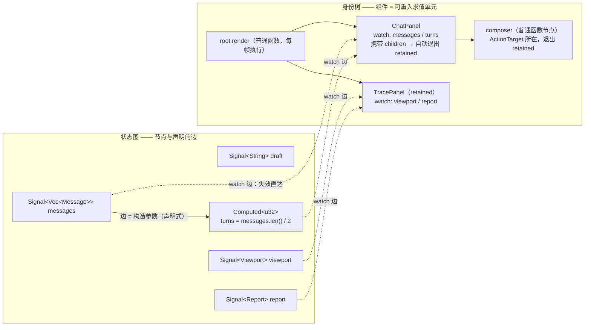
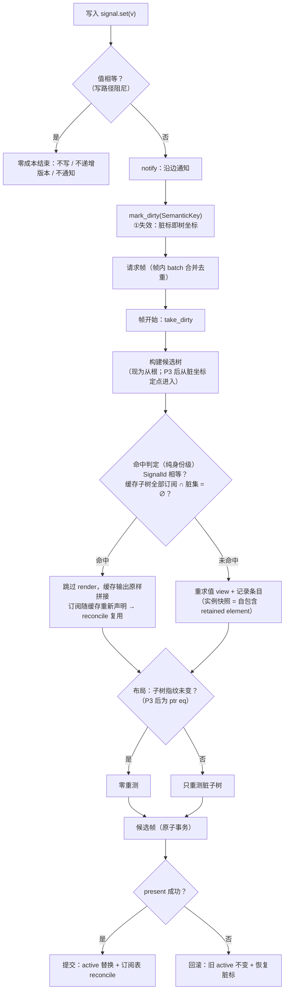
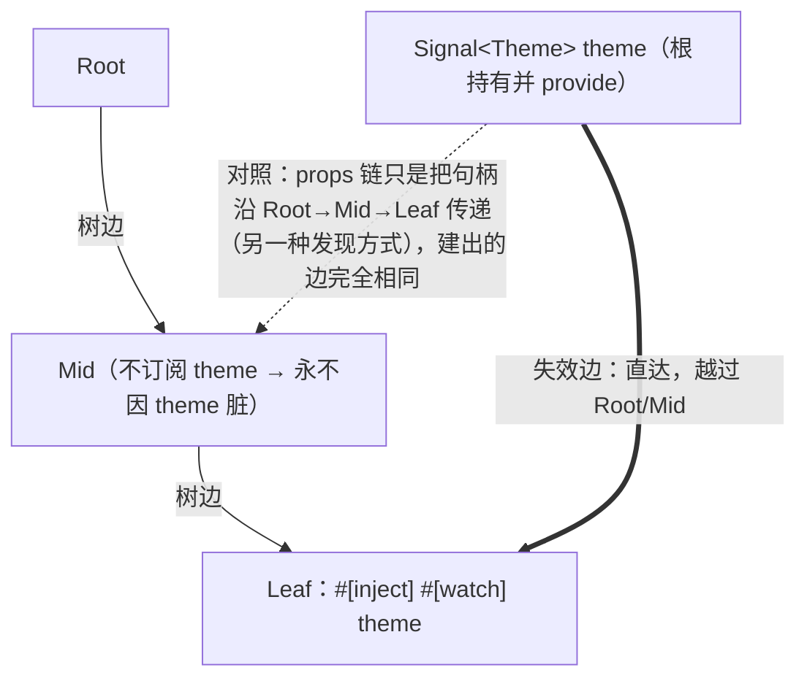
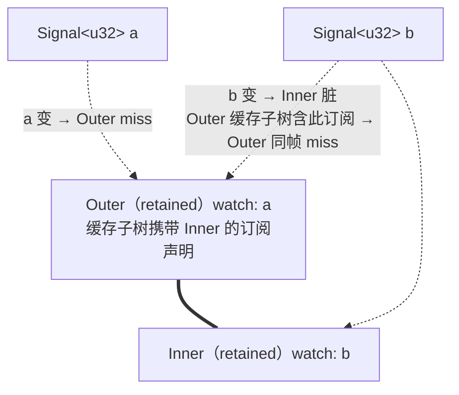

# 响应式核心抽象：边、坐标与身份

> 一切动态性皆显式的边；一切更新皆按坐标的定点重入；一切复用皆身份匹配。

本文定义 tela 响应式系统的核心抽象，并以此为唯一依据推导全部特性。任何新特性先过两问：**它的动态性是否表达为显式的边？它的运行时比较是否身份级？**——两问皆过才进核心。

> **状态声明**：本文是目标态规范（normative），不是现状描述。当前实现与本文的差距逐条列于 [002 附录一](./002-渲染管线：脏的传导与身份缓存.md)，归位路径见 §7。

---

## 1. 思想

三条规则，无例外条款：

1. **图**：状态 = 图节点（源节点 `Signal`、派生节点 `Computed`）。依赖 = 构造时声明的边（参数即边），不做运行时发现。写入沿边传播脏。
2. **树**：界面 = 身份树。组件 = 树上的可重入求值单元（输入边 + 身份坐标 + 求值器）。更新 = 对最外层脏坐标的定点重求值与拼接。
3. **比较**：读路径零内容比较——diff、指纹、值比较不存在。内容相等只允许出现在写路径（相等性短路，作为传播的阻尼）。复用凭身份或指针，不凭内容。

**运行时比较量 ∝ 1 / 失效信息完备度。** 比较是"不知道什么变了"时付出的运行时搜索代价；每声明一条边，就消灭一类比较。本抽象把"发现变化"全部搬到编译期与写路径，运行时只执行已知的变化。

## 2. 特性推导

没有一条特性是"加"上去的，全部是三条规则的直接推论：

| 特性 | 原理规定 |
|---|---|
| `Signal<T>` | 源节点。相等性短路（写路径阻尼：值没变不写、不递增版本、不通知）；版本号 = O(1) 新鲜度检查 |
| `Computed<T>` | 派生节点。**边即构造参数**：`computed2(&a, &b, f)` 的参数表就是依赖声明。源变 → 立即重算 → `set` 输出；值相等则传播在此终止（短路是图的阻尼）。单线程顺序执行天然无 glitch |
| `#[watch]` props | 树位置观察图节点的边，是 derive 组件**唯一**的输入形态。数据、viewport、派生值一律以边进入 |
| identity / `key` / `For` | 同一坐标系统的三种呈现（组件身份、业务 key、SemanticKey）。让位置在变化间稳定，复用 = 身份匹配。For 对账按 key，不比内容 |
| retained（原"memo"） | **求值语义本身，不是优化**：入边无脏 → 不重求值，缓存输出原样拼接。derive 组件默认生效；收到 children 内容自动退出。命中判定 = watch 字段 `SignalId` 相等（u64）+ 缓存子树内全部订阅未被标脏 |
| `provide` / `inject` | **边的另一种源端发现方式**。provide 一个 `Signal`/`Computed` + 注入点 watch 它 = 一条从提供者**越过中间节点直达注入点**的边——依赖图本来就不是树，失效不经过中间节点。provide 普通值 = 作用域查找（服务定位），不是边、契约即恒定。props 与 inject 的全部区别：源端发现方式（沿父链传递 vs 作用域查找），建出的边同构。注：失效边直达，但 P3 之前的重建路径仍沿祖先走（祖先缓存子树含该边则 miss），与 For 行语义一致 |
| children | 现阶段：闭包（FnOnce + 借用）不可跨帧持有，携带 children 的组件自动退出 retained。注意这不等于"缓存仅限叶子"：P3 定点重入后，**脏路径上的非 retained 包装器也不重执行**——重入发生在最深的脏 retained 元素，包装器只是 spine 上的 Rc 节点被路径拷贝（O(深度) 指针写）。远期：children 从闭包变成**槽位边**（树位置 → 树位置的 key 注册；子输出为 Rc 时命中 = ptr eq，即 P5 的轻量形态） |
| 宿主态（viewport 等） | 也必须是图节点。viewport 以 `Signal<Viewport>` 进入；focus/hover/scroll/时钟为遗留的帧级全局例外（见 §6） |

### 2.1 关键语义细节

**脏检查覆盖缓存子树的全部订阅。** 组件命中缓存时，其缓存输出携带整棵子树的 watch 声明；判定要检查子树内**所有**订阅的 key 是否被标脏。因此"只改某一行的 signal、不动列表 signal"会让持有该行的父组件失效，然后其余行命中、只重渲染被改的行——粒度等价于 Solid 的 store。

**嵌套 retained 的吸收。** 父 miss 重渲染时，子组件照常做自己的命中判定；子的输入（同一批 signal 对象 + 自身订阅未脏）与父的行为完全解耦。父渲染一万次，子的判定永远只查自己的 id 和脏集。

**if 分支。** 分支条件必须来自被订阅的 signal；条件变化 → 脏 → miss → 走新分支，旧分支卸载（状态回收、订阅释放）、新分支 setup 一次。命中时整个 if 冻结在缓存输出里。

**事务。** 候选帧三段式（begin / commit / discard）与失败回滚语义不变——这是 retained 渲染的正确性基础设施，与抽象正交。

## 3. 禁止清单

以下事物被规则 ③（或规则 ①）排除在核心之外：

- **diff / 虚拟树比对**——运行时发现变化（违反规则 ③）
- **props 值比较 / 指纹**——同上；derive 组件不拥有普通值 props，通道不存在
- **自动依赖追踪**——把声明搬进运行时（违反规则 ①）。tela 选择显式声明：可 grep、编译期可见、可强制
- **provide 恒定值后再修改它**——普通值的 provide 契约即恒定；要变就必须是节点（provide `Signal` 走边）。旧实现中 `ProvidedValue` 的 `Send + Sync` 约束（装不下 Rc 的 `Signal`）属实现残留，应去除
- **引用 props（`&str`/`&[T]`）**——指向父渲染栈数据，跨帧缓存持有即悬垂；零拷贝由 Signal 句柄传递 + `with()` 借用读取达成
- **常量装箱**——恒定值不属于任何通道：静态文本/颜色直接写在 view 体里（随输出被 retained/身份缓存覆盖），既不是 props 也不是 Signal，零身份分配、零失效参与。需要"变"的那一刻它才是数据，才需要成为节点
- **惰性 getter props**——惰性只解决"读到新值"，不解决"知道要更新"；两者的答案都是边

## 4. 定位：三层配方与业界对照

高性能 UI 更新的通用三层配方，与本抽象的对应：

| 层 | 职责 | 本抽象的实现 | 状态 |
|---|---|---|---|
| ① 失效 | 知道什么变了 | Signal/Computed 边 + 脏标（精确到组件 key） | ✅ |
| ② 范围遍历 | 只访问脏的部分 | 脏 key = 树坐标 → retained 条目重入拼接 | P3 |
| ③ 分层缓存 | 脏了也不重算贵的部分 | retained 输出缓存（✅）+ 布局子树指纹缓存（✅，待 Rc 化为 ptr eq） | 🟡 |

与业界的关系：

- **Solid**：本抽象与 Solid 的数据模型对齐（signal 图、组件只跑一次的求值语义），但依赖显式声明而非自动追踪；直写原语（无中间树）是 Solid 的优势，tela 的 ②③ 层是它的等价物
- **Compose**：retained 命中判据从"参数相等"退化为"SignalId 相等"——因为输入只能是边
- **Flutter / 浏览器**：②层的参照系（脏列表 / 失效子树）；tela 的 `SemanticKey` 身兼两职——既是失效坐标又是遍历入口，①的输出天然就是②的输入
- **ImGui**（反例）："整帧便宜到不需要粒度"只在无真实排版/滚动协议的工具级 UI 成立，tela 的整帧地板天然更高，必须走粒度路线

## 5. 运行时模型（实现映射）

```
Signal::set(v)                      写路径：相等短路；notify 沿边
  → mark_dirty(SemanticKey)         ①失效：精确到树坐标，帧内合并（batch + take_dirty）
  → 帧开始：ensure_frame 入口短路（无脏且未失效 → 零工作）
  → 构建候选树：组件命中判定（SignalId 相等 + 子树订阅无脏）
       命中 → 缓存输出原样拼接（订阅随缓存重新声明，reconcile 复用）
       未命中 → 重求值 + 记录条目（实例快照 = 自包含 retained element）
  → 布局：子树指纹缓存，未变子树零重测
  → 候选帧原子提交 / 失败回滚（脏标恢复）
```

derive 组件的结构保证：view 体只能读自身的 watch 字段与常量（无捕获通道）——绑定级完全声明由类型系统强制。手写 `DslComponent`（foundation 组件等）是显式逃生通道，永不 retained。

## 6. 边界与诚实审计

抽象达成范围的准确表述：

**绑定级完全声明**——数据通道达成；例外清单：

- focus / hover / scroll / modal / 动画时钟：帧级全局失效（正确但粗），P4 逐个收编为图节点
- 手写 `DslComponent` impl：契约不强制（文档约定）；点名两个存量例外不作推广范式——`VirtualWindowView`（provide 会变值：offset_y 源自 scroll_offsets，P4 scroll 收编）与 `DraftInputView`（受控输入值通道 + 私有 State，desktop-demo 使用）
- **运行期恒定数据通道**：构造期一次产生、之后永不变的数据（如桥查询缓存），以 set-once `Signal` 承载——有身份、永不脏、相等性短路天然成立；不引入新的 props 通道
- 视图读取全局可变状态 / 时间：任何响应式系统的通病，无法禁止

**内部身份为整数句柄**（落地约定）：`SiteId(u32)`/`ScopeId(u64)` interner 驻留调用点与 scope 链；相等/排序/哈希是整数比较。字符串只存在于三处：节点业务 key（`SemanticKey`）、`For` 行 key、Debug 输出。

**运行时零比较**——读路径仅剩身份级：

- 保留：`SignalId` 相等（u64）、脏位、版本号、集合查找
- 写路径（设计选择）：`set` 相等短路 O(值)，换空帧归零
- 唯一内容级残留：**布局子树指纹**（O(子树)），P3 `UiNode` 子树 Rc 化后变指针相等
- 微小残留：收敛循环的 FrameContext 比较、scroll clamp 值比较（均 O(1) 字段级）
- 非比较的 O(变化) 缺口：每帧整树组装 / 身份分配 / 锚点 resolve（P3 ②层）

## 7. 路线图

```
P1  signal-only 契约     derive 字段只允许 #[watch] + key；删 #[memo] 注解与全部指纹机制；
                         retained 成为 derive 默认求值语义；viewport 收编为 Signal
P2  Computed 原语        computed/computed2/computed3；边即参数；短路阻尼
P3  ②层 + Rc 子树        脏坐标 → retained 条目定点重入，O(脏×深度) 拼接；
                         UiNode 子树 Rc 共享（命中 = ptr eq，消灭布局指纹与深克隆）
P4  宿主态收编           focus/hover/时钟 → 图节点；State 内建 signal + 显式订阅；
                         收窄 handle→全局失效的兜底
P5  children 槽位化      闭包 → 槽位边；携带 children 的组件进入 retained（研究性）
```

**P5 机制具体化（绑定级静态布线）**：编译期算的不是值，是**更新的布线**。宏从 ui! 模板为每个插值槽生成 `&'static [BindingSlot]` 静态表：

- **访问器用 fn 指针**：`fn(&Comp) -> &Signal<T>`（非捕获闭包静态化），表落在只读数据段，零运行时数据、零 unsafe 偏移量
- **槽位分两类**：paint 槽（fill/opacity/offset → 直写呈现层状态，零下游）与 layout 槽（text/size → 写入后把该节点的几何脏交给布局级，复用传播与边界）——文本变化会改几何，不能当纯绘制写
- **槽位目标是呈现层按身份持有的可变状态**（结构与绑定分离），不修改 Rc 共享树
- **if 分支 = SlotSelector**：持有条件的 `SignalId`，条件脏时原子注销旧槽位组、实例化新槽位组——边集的实例化/注销，非运行时发现
- **For = ListFactory**：key 提取函数 + 行模板静态槽位表；运行时仅按 key 对账（u64 身份比较）幂等实例化/注销

依赖关系：P1 是 P3 的地基（自包含条目才能独立重入）；P2 与 P1 无依赖可并行；P4/P5 由痛点驱动排序。

## 8. 图解

### 8.1 双世界模型：状态图 + 身份树 + 跨界的 watch 边



要点：watch 边从图节点**直达**树位置——中间节点不参与失效；树上有三种节点（retained 组件 / 携带 children 的组件 / 普通函数），只有第一种可命中缓存。

### 8.2 一次更新的全生命周期



### 8.3 边的源端发现：props 链 vs inject 作用域（建出的边相同）



### 8.4 嵌套冻结：父 miss，子命中



结果：a 变 → Outer 重渲染，Inner 命中冻结（子的判定与父行为解耦）；b 变 → 双双 miss，只重渲染 Inner 的内容。

## 附录：设计问答（ rationale ）

**Q：已有 SignalId 和 SemanticKey，为什么不需要 props 比较？**
id 回答"订阅了哪些 signal"，key 回答"在树的哪里、值变没变（脏标）"。props 值是第三个通道——"父这次传了什么"，id/key 都看不见。两条出路：运行时比较（本抽象拒绝，规则 ③）；让通道本身不存在——输入只能是边，计算值以 `Computed` 节点传递（本抽象的选择）。Solid 用惰性 getter + 自动追踪达到同一效果；tela 用显式边。

**Q：provide/inject 在图里是什么？**
两种东西：provide `Signal`/`Computed` 且注入点 watch 它 = 一条从提供者越过中间节点直达注入点的边（失效不经过中间节点；props 传递的 signal 本来也是这种直达边，props 与 inject 只差源端发现方式）；provide 普通值 = 作用域查找，不是边、契约即恒定。旧实现 `ProvidedValue` 的 `Send + Sync` 约束装不下 `Signal`，属实现残留，去除后机制零新增（注入的 signal 走同一 `watch_source` 订阅）。

**Q：为什么 props 不能是引用？**
引用指向父渲染栈上的数据；retained 条目跨帧持有 props 快照，缓存里的 `&str` 会指向已销毁的栈帧。零拷贝由 Signal/Computed 句柄（Rc）传递 + `with()` 借用读取达成——句柄跨帧安全，`&T` 不是。

**Q：更新能否保证"父更新、子树不更新"？**
能。子的命中判定只看三件事：身份没变、绑定的还是同一批 signal 对象、自己的订阅没脏——与父组件行为完全解耦。父因任何原因 churn，子冻结。该保证仅作用于 retained 边界；边界之间的普通代码随父重执行，重的子树在根上放一个组件即可整块冻结。

**Q：Signal 主要作用于哪一层？**
①失效层是它的本职；对②层它的贡献是"脏标即树坐标"——订阅绑定 `(key, signal_id)` 使失效信息天生携带遍历入口。②建不建是遍历机制的事，坐标已经免费给了。

**Q：条件分支会不会导致过度失效？**
会，且代价有界——**不会级联**。声明式边在"同一表达式内条件读不同 signal"时过度失效，但阻尼把传播掐断在第一个节点：`Computed` 重算后值相等 → `set` 短路 → 下游零脏；组件重渲染输出相同 → 布局几何稳定即止。所以真实代价 = 被误声明信号**实际变化时**的一次节点重算（偶发、有界），对比自动追踪的**每次读取**付栈检查 + 每次重算付依赖集对账（常在）——偶发有界优于常在无界。更重要的是**条件的惯用形态在树级不在节点级**：`if` 分支切换 = 不同组件集的挂载/卸载 = 静态边形状的实例化/注销，未挂载分支零边、零浪费。昂贵计算的**门控管道模式**：各分支计算挂在各自的 `Computed` 上，选择器只做挑选——误脏重算的是门控节点而非昂贵分支。这是与 Compose strong-skipping 同一笔交易：用"声明可能过宽"换"判定零成本 + 图可审计"。

**Q：为什么不做运行时自动依赖追踪（Solid/Vue 式）？**
三个理由，且都与本文的公式直接相关。①**依赖集对账本身是运行时比较**：自动追踪每次 `get()` 付观察者栈检查，每次重算付"清理旧依赖 + 重新收集"的集合对账——它没有消除比较，只是把比较从"判断输出是否变了"移到"维护边集是否准确"，"比较量 ∝ 1/完备度"对它不成立。②**行业证据反向**：Svelte 5 抛弃了隐式 `$:` 响应式转显式 runes，React Compiler 用静态分析插入记忆化——最新一代主流是"语法显式 + 编译器推导"（tela 的 `#[watch]` 字段与 `computed(源参数)` 正是其 Rust 形态），不是运行时追踪。③**Rust 现实**：追踪上下文要求 thread-local 栈与动态依赖集合，与借用检查缠斗；字段即边是只读访问，借用天然友好，依赖关系完全由类型表达。
