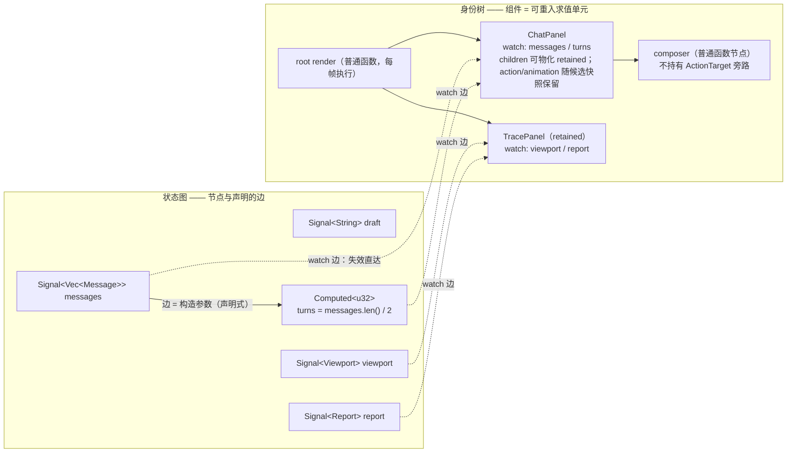
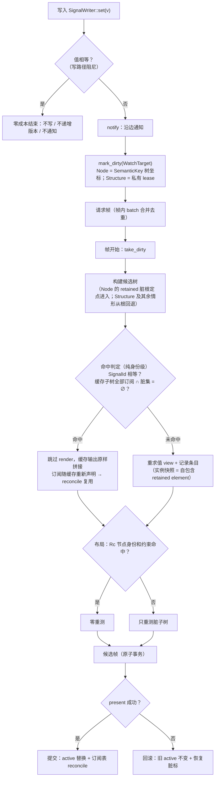
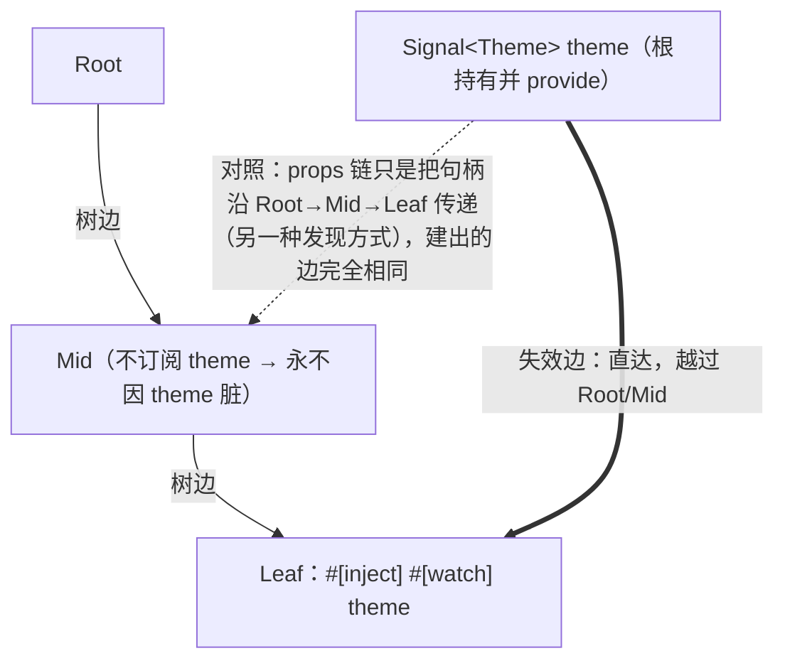
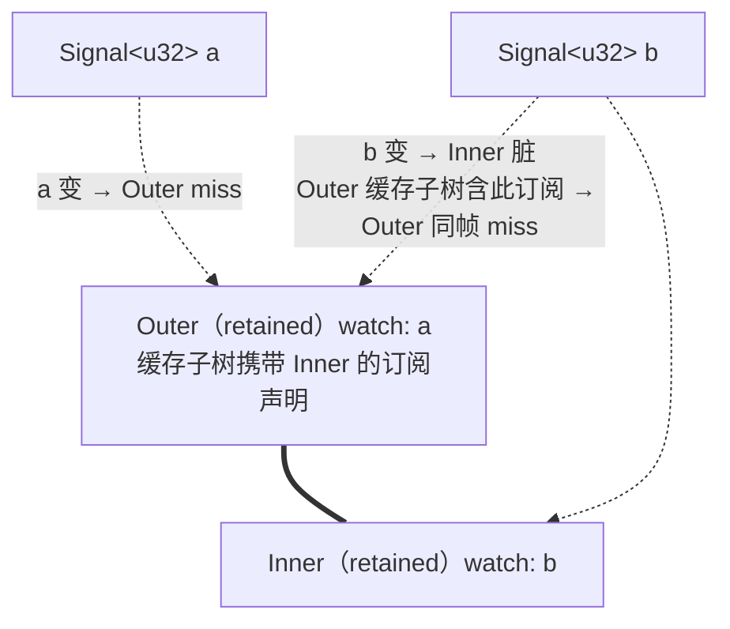

# 响应式核心抽象：边、坐标与身份

> 一切动态性皆显式的边；一切更新皆按坐标的定点重入；一切复用皆身份匹配。

本文定义 tela 响应式系统的核心抽象，并以此为唯一依据推导全部特性。任何新特性先过两问：**它的动态性是否表达为显式的边？它的运行时比较是否身份级？**——两问皆过才进核心。

> **状态声明**：本文是目标态规范（normative），不是现状描述。当前实现与本文的差距逐条列于 [002 附录一](./002-渲染管线：脏的传导与身份缓存.md)，归位路径见 §7。
>
> **2026-08-31 实现检查点**：003 已落地 `UiSpec`、候选 Output 事务与显式 watch 的候选版本复核。P3 已有 retained 脏根的候选重入、`Rc<UiNode>` 路径拼接与最深优先的嵌套重入：脏 child 先产生候选输出并替换父 `MemoEntry` 的物化 child 槽位，最后只 splice 最外层根。重入会同时保留树外静态呈现 sidecar，并以候选计划替换重入根内 sidecar、HostInput / Parent Event 路由和按组件 scope 归属的动画调度。树外存活路由会在候选树上重新解析，active 路由直到提交前不变。`Children` 现为默认槽位加静态命名槽位的单次消费集合：derive `view` 只有调用 `children.build(build)` 或 `children.build_named(name, build)` 时才创建孩子并登记其 lease、Output、watch 和动画；retained 重入也只在相同消费点恢复相应槽位快照。调用点的 `FnOnce` 闭包绝不跨帧保存，停止消费已物化槽位会撤销对应 memo 条目并走根级结构对账。调用点可直接把 `Signal` / `Computed` 交给透明 `For` / `Show` / `Switch`：它们以框架私有、完整 lease（identity + 全局单调 generation）登记结构 watch；空列表和无物理根的分支都不借用孩子身份，候选失败会归还结构 dirty，成功卸载后才注销订阅。`Switch` 通过命名 `branch` / `render` 函数选择稳定分支身份，不要求宏识别 `match` 或 `<Case>`。结构 dirty 没有物理树坐标，故保守回退根级候选投影而不进入 retained 或呈现直写快路径。静态 binding 可以与 retained 重入合入同一候选；彼此嵌套的 binding 按最深到最浅的路径投影，后写父壳时保留已更新的 child `Rc`。若同一 retained 根同时有普通 watch 与 binding，普通 watch 仍先触发该根候选重入，binding 只对新根同步，不能绕过 `view`；若 binding 位于恢复的 child 快照内，本帧会以未 prime 的候选绑定强制同步当前值，避免把新版本错误记到旧呈现值上。Host 投影与这种 binding/retained 图脏边同帧时共享同一候选 tree，并在一次 resolve 中合入 candidate HostState 与 damage；没有独立 retained 根的普通 watch、重入后无法再解析 binding 目标、结构、全局 viewport 变化和其他无法选择窄候选的图脏边仍保留根级候选投影。P5 已接通组件声明的静态呈现绑定：`Text`/`Icon` 的 `Signal<String>` 与 `Signal<Color>`，任何使用静态槽表或 `StaticBindingSelector` 的自定义 `UiSpec`，以及 derive 的 `#[bind(paint = path)]` / `#[bind(layout = path)]` 输出根简写，都会在候选副本中更新，再经 `RenderPlan` 发布路径提交；选择器候选失败前保留旧分支订阅，成功提交后才切换到新分支。从任意模板表达式自动生成 binding 不是待补功能，而是明确排除项；更多绑定只能由组件契约显式声明。ACK 增量传输和局部 WGPU damage 重绘已经接通；guest resolve 现在产生候选化树形 `RenderPlan`，以局部命令片段、边的平移/clip 和顶层 Teleport overlay 保留绘制语义，片段缓存只在 `presented(token)` 后晋升。WGPU、Canvas 与 raster 直接遍历该计划；`UiFrame` 只在 ABI/wire 或显式诊断/导出转换边界物化，不构成应用、DSL 或会话 API 的兼容回退。每次 swapchain acquire 后的 backing-to-surface copy 仍是可呈现表面的必需工作。

---

## 1. 思想

三条规则，无例外条款：

1. **图**：状态 = 图节点（源节点 `Signal`、派生节点 `Computed`）。依赖 = 构造时声明的边（参数即边），不做运行时发现。写入沿边传播脏。
2. **树**：界面 = 身份树。组件 = 树上的可重入求值单元（输入边 + 身份坐标 + 求值器）。更新 = 对最外层脏坐标的定点重求值与拼接。
3. **比较**：读路径零内容比较——diff、指纹、值比较不存在。内容相等只允许出现在写路径（相等性短路，作为传播的阻尼）。复用凭身份或指针，不凭内容。

**运行时比较量 ∝ 1 / 失效信息完备度。** 比较是"不知道什么变了"时付出的运行时搜索代价；每声明一条边，就消灭一类比较。本抽象把"发现变化"全部搬到编译期与写路径，运行时只执行已知的变化。

## 2. 特性推导

没有一条特性是"加"上去的，全部是三条规则的直接推论：

| 特性 | 原理规定 |
|---|---|
| `Signal<T>` | 源节点。相等性短路（写路径阻尼：值没变不写、不递增版本、不通知）；版本号 = O(1) 新鲜度检查 |
| `Computed<T>` | 派生节点。**边即构造参数**：`computed2(&a, &b, f)` 的参数表就是依赖声明。源变 → 立即重算 → `set` 输出；值相等则传播在此终止（短路是图的阻尼）。单线程顺序执行天然无 glitch |
| `#[watch]` props | 树位置观察图节点的动态数据边，是 derive 组件唯一的**响应式数据**输入形态。数据、viewport、派生值一律以边进入；另允许 `#[inject]` / `#[provide]` 传递显式、只读的 Context capability，但它们不是宏猜测出来的响应式 Props |
| identity / `key` / `For` | 同一坐标系统的三种呈现（组件身份、业务 key、SemanticKey）。让位置在变化间稳定，复用 = 身份匹配。For 对账按 key，不比内容 |
| retained（原"memo"） | **求值语义本身，不是优化**：入边无脏 → 不重求值，缓存输出原样拼接。derive 组件默认生效；首次装配后的 DSL children 可物化为 `RetainedChildren`，并随 `MemoEntry` 保存可克隆的 HostInput route blueprint 与动画 scope。命中判定 = watch 字段 `SignalId` 相等（u64）+ 缓存子树内全部订阅未被标脏；直接拥有脏 watch 的 retained 根可候选重入，父子同时脏时按最深 child 到父的顺序替换候选 child 槽位，最终仅 path-copy 最外层根；普通 watch、结构或不兼容输出仍回退完整候选投影。 |
| `provide` / `inject` | **边的另一种源端发现方式**。provide 一个 `Signal`/`Computed` + 注入点 watch 它 = 一条从提供者**越过中间节点直达注入点**的边——依赖图本来就不是树，失效不经过中间节点。provide 普通值 = 不可变词法 scope 的快照查找，不是边；只有拥有者下一次候选重装配才能替换整个 scope。props 与 inject 的全部区别：源端发现方式（沿父链传递 vs 作用域查找），建出的边同构。注：失效边直达；当前满足 P3 retained 条件的目标可定点重入，结构、宿主状态投影或不能物化的 children 才保守沿祖先回退到根候选路径，与 For 行语义一致 |
| children | `Children` 是一次性、按实际消费生效的默认/命名槽位边：调用点以 `FnOnce + 借用` 提供 builder，但 derive `view` 只在显式调用 `children.build(build)` 或 `children.build_named(name, build)` 时才物化对应 `ViewChild`、watch、可克隆 HostInput route blueprint 和动画 scope；没有调用便不创建/挂载孩子。成功消费后，这些候选声明按槽位变成 `MemoEntry` 持有的 `RetainedChildren`；独立重入也只在再次消费同一槽位时恢复并登记子树。父子 retained 同时脏时，child 先重入并把新输出写入父候选槽位，父随后重入，最终只对父根做路径拼接；这不等于“缓存仅限叶子”，包装器仍是 O(深度) 的 Rc spine。若一个已物化槽位后来不再被消费，这是结构删除：旧 memo 条目在候选中撤销并回退根级对账，而不是保活旧 children。 |
| 宿主态（viewport 等） | 也必须是图节点。viewport、focus、hover、动画时钟、窗口最大化、当前模态栈顶和按 scroll key 的 `ScrollState` 都以只读 `Signal` 进入（见 §6） |

### 2.1 关键语义细节

**脏检查覆盖缓存子树的全部订阅。** 组件命中缓存时，其缓存输出携带整棵子树的 watch 声明；判定要检查子树内**所有**订阅的 key 是否被标脏。因此"只改某一行的 signal、不动列表 signal"会让持有该行的父组件失效，然后其余行命中、只重渲染被改的行——粒度等价于 Solid 的 store。

**嵌套 retained 的吸收。** 父 miss 重渲染时，子组件照常做自己的命中判定；子的输入（同一批 signal 对象 + 自身订阅未脏）与父的行为完全解耦。父渲染一万次，子的判定永远只查自己的 id 和脏集。

**if 分支。** 分支条件必须来自被订阅的 signal；条件变化 → 脏 → miss → 走新分支，旧分支卸载（状态回收、订阅释放）、新分支 setup 一次。命中时整个 if 冻结在缓存输出里。

**事务。** 候选帧三段式（begin / commit / discard）与失败回滚语义不变——这是 retained 渲染的正确性基础设施，与抽象正交。

## 3. 禁止清单

以下事物被规则 ③（或规则 ①）排除在核心之外：

- **diff / 虚拟树比对**——运行时发现变化（违反规则 ③）
- **props 值比较 / 指纹**——同上；derive 组件不拥有普通值 props，通道不存在。普通 Context capability 只能明确标成 `#[provide]` / `#[inject]`，它不进入值比较或自动失效路径
- **自动依赖追踪**——把声明搬进运行时（违反规则 ①）。tela 选择显式声明：可 grep、编译期可见、可强制
- **从任意 Rust 模板表达式自动生成 binding**——这会让 `ui!` 或编译器根据读取推导更新边，等价于在语法层恢复隐式订阅。可扩展性只允许组件或 derive 显式声明 `BindingSlot` / `StaticBindingSelector`；调用点传入 `Signal` 不会被宏静默升级为未知子树的绑定
- **把普通 provide 当作可变共享状态**——消费者没有写能力，普通 capability 也不会独立唤醒已提交子树；拥有者若在下一候选重装配中替换它，消费者会重新解析新 scope。要让变化本身成为失效边，必须 provide `Signal` / `Computed` 并显式 watch/bind。`ProvidedValue` 已不要求 `Send + Sync`，因此可承载单线程 `Rc` Signal；这不改变“普通值不是响应边”的约束
- **引用 props（`&str`/`&[T]`）**——指向父渲染栈数据，跨帧缓存持有即悬垂；零拷贝由 Signal 句柄传递 + `with()` 借用读取达成
- **常量装箱**——恒定值不属于任何通道：静态文本/颜色直接写在 view 体里（随输出被 retained/身份缓存覆盖），既不是 props 也不是 Signal，零身份分配、零失效参与。需要"变"的那一刻它才是数据，才需要成为节点
- **惰性 getter props**——惰性只解决"读到新值"，不解决"知道要更新"；两者的答案都是边

## 4. 定位：三层配方与业界对照

高性能 UI 更新的通用三层配方，与本抽象的对应：

| 层 | 职责 | 本抽象的实现 | 状态 |
|---|---|---|---|
| ① 失效 | 知道什么变了 | Signal/Computed 边 + 脏标（精确到组件 key） | ✅ |
| ② 范围遍历 | 只访问脏的部分 | 脏 key = 树坐标 → retained 条目重入拼接 | P3 |
| ③ 分层缓存 | 脏了也不重算贵的部分 | retained 输出缓存（✅）+ `LayoutCache`（`Rc<UiNode>` 身份 + 约束）+ 叶子 `MeasureCache`（内容/样式/约束键） | 🟡 |

与业界的关系：

- **Solid**：本抽象与 Solid 的数据模型对齐（signal 图、组件只跑一次的求值语义），但依赖显式声明而非自动追踪；直写原语（无中间树）是 Solid 的优势，tela 的 ②③ 层是它的等价物
- **Compose**：retained 命中判据从"参数相等"退化为"SignalId 相等"——因为输入只能是边
- **Flutter / 浏览器**：②层的参照系（脏列表 / 失效子树）；普通物理 watch 以 `SemanticKey` 同时充当失效坐标和遍历入口。透明结构的直接 source 是有意的例外：它只以私有 lease 表示“重装配这个结构”，没有伪造树坐标，因此明确走根级候选投影
- **ImGui**（反例）："整帧便宜到不需要粒度"只在无真实排版/滚动协议的工具级 UI 成立，tela 的整帧地板天然更高，必须走粒度路线

## 5. 运行时模型（实现映射）

```
SignalWriter::set(v)                写路径：相等短路；notify 沿边
  → mark_dirty(WatchTarget)         ①失效：`Node(SemanticKey)` 精确到树坐标；透明结构 source 为私有
                                      `Structure(ComponentLease)`，帧内合并（batch + take_dirty）
  → 帧开始：ensure_frame 入口短路（无脏且未失效 → 零工作）
  → 构建候选树：Node target 可做组件命中判定（SignalId 相等 + 子树订阅无脏）；
                   Structure target 必须从根重投影
       命中 → 缓存输出原样拼接（订阅随缓存重新声明，reconcile 复用）
       未命中 → 重求值 + 记录条目（实例快照 = 自包含 retained element）
  → 布局：`Rc<UiNode>` 身份 + 约束命中 `LayoutCache`，未变子树零重测
  → 候选帧原子提交 / 失败回滚（脏标恢复）
```

derive 组件的结构保证：view 体只能读自身的 watch/bind 字段、显式 `#[inject]` capability 与常量（无捕获通道）——绑定级完全声明由类型系统强制。普通 Context capability 是当前词法装配的只读快照，不单独形成失效边；它随父候选重装配重新解析。Context 没有 SignalId 比较契约，因此包含它的 derive 组件在父重装配时不命中普通 retained cache；其已提交的子树仍可因自己的显式 Signal 边、连同当前提交时记录的 capability 快照独立重入。若 capability 本身需要独立驱动消费者更新，提供和注入的必须是 `Signal<T>` / `Computed<T>`。手写 `DslComponent`（foundation 组件等）是显式逃生通道，永不 retained。

## 6. 边界与诚实审计

抽象达成范围的准确表述：

**绑定级完全声明**——数据通道达成；例外清单：

- viewport、hover、pressed、focus、动画时钟、窗口最大化、当前模态栈顶与按 scroll key 的 `ScrollState` 已经以只读 `Signal` 进入 `FrameContext`；Host 保留全部 writer，`FrameContext` 不再向 controller 暴露这些值的普通快照。纯 scroll/focus/window 投影可以复用 active 共享树创建候选 frame，不重跑 controller 根 render；按 scroll key 的 HostInput 还会把 `VISUAL` 脏坐标传给 profile，因此 damage 限于该已提交滚动视口。原生命中、焦点仲裁、窗口/模态等尚无可证明树坐标的投影，以及正在活动的 transition，仍走保守的全视口 damage。
- 手写 `DslComponent` impl：契约不强制（文档约定）；点名两个存量例外不作推广范式——`VirtualWindowView`（provide 的 `offset_y` 由 scroll source 驱动，P4 scroll 收编）与 `DraftInputView`（受控输入值通道 + 私有 State，desktop-demo 使用）
- **运行期恒定数据通道**：构造期一次产生、之后永不变的数据（如桥查询缓存），以 set-once `Signal` 承载——有身份、永不脏、相等性短路天然成立；不引入新的 props 通道
- 视图读取全局可变状态 / 时间：任何响应式系统的通病，无法禁止

**内部身份为整数句柄**（落地约定）：`SiteId(u32)`/`ScopeId(u64)` interner 驻留调用点与 scope 链；相等/排序/哈希是整数比较。字符串只存在于三处：节点业务 key（`SemanticKey`）、`For` 行 key、Debug 输出。

**运行时零比较**——读路径仅剩身份级：

- 保留：`SignalId` 相等（u64）、脏位、版本号、集合查找
- 写路径（设计选择）：`set` 相等短路 O(值)，换空帧归零
- 布局树缓存不做重建内容指纹：`LayoutCache` 只以 `Rc<UiNode>` allocation identity + `Constraints` 命中；叶子 `MeasureCache` 以内容、样式和约束组成的有限结构键复用测量结果
- 微小残留：收敛循环的 FrameContext 比较、scroll clamp 值比较（均 O(1) 字段级）
- 非比较的 O(变化) 缺口：直接拥有全部脏 watch 的 retained 根已可定点重入，嵌套根按最深 child 到父的候选槽位替换处理，并在候选中替换自己的 HostInput / Parent Event / animation 计划；静态 binding 即使目标彼此嵌套也按最深到最浅投影，同坐标 retained watch 会先重入再同步 binding，恢复 child 快照内的脏 binding 仍会先在候选中同步当前值。Host 投影和这两类有坐标的图脏边同帧出现时，复用同一张 binding/retained 候选树，并把候选 HostState 与 Host damage 一起送入 resolve；不会因为两类输入并存而强制根装配。没有独立 retained 根的普通 watch、重入后不存在的 binding 目标、结构，或不能选择上述窄候选的图脏边，仍会走根级候选装配和锚点解析；宏不会从任意 Rust 表达式或 `match` 自动推断 binding/结构边。guest 已不再为正常渲染建立全局 `Vec<DrawCommand>`：`RenderPlan` 缓存局部片段并在遍历时投影坐标/clip。仍需按完整 paint order 遍历的 ABI snapshot/patch 编码和 damage 重放是明确的边界；更细的子树/后端 batch 复用属于后续性能工程，不能缓存已烘焙的绝对 `DrawCommand` 片段。

## 7. 路线图

```
P1  signal-only 契约     derive 的动态数据字段只允许 #[watch] / #[bind] + key；`#[inject]` /
                         #[provide] 仅传递显式 Context capability，不形成普通值 Props 通道；移除旧 memo 注解与全部内容指纹机制；
                         retained 成为 derive 默认求值语义；viewport 收编为 Signal
P2  Computed 原语        computed/computed2/computed3；边即参数；短路阻尼
P3  ②层 + Rc 子树        脏坐标 → retained 条目定点重入，O(脏×深度) 拼接；
                         已实现 retained 根及其静态呈现 sidecar 的受限路径，嵌套脏根按最深 child 到父替换候选槽位；
                         组件路由、物化 children action/animation 与动画计划已候选化；静态 binding 可与重入同帧合流，
                         嵌套 binding 按最深到最浅 path-copy，同坐标 retained watch 先重入再同步 binding，恢复 child 快照内的
                         脏 binding 在候选中强制同步；没有独立 retained 根的普通 watch、目标消失的 binding、结构、全局 viewport
                         变化或无法选择窄候选的图脏边仍走根级逃生口
P4  宿主态收编           viewport/focus/hover/pressed/时钟/window/modal/scroll-key 已成为只读图节点；纯宿主投影
                         可复用 active 共享树走候选 resolve/present；它与可独立重入的 retained 根或 binding 脏边同帧时
                         共享同一候选 tree + HostState/damage，不因混合输入强制根装配；scroll-key 已有视口范围的局部
                         visual damage，未知坐标、window/modal 等必要宿主投影仍保守扩大 damage
P5  children 槽位化      闭包 → 单次槽位边；携带 children 的组件按实际消费进入 retained（已落地）
                         `MemoEntry` 持有的物化 retained child 槽位、嵌套脏根最深优先替换、消费时 lease/watch/route 登记与
                         停止消费后的根级结构删除均已实现；默认槽位和编译期字面量命名槽位可独立消费、保留和注销，
                         静态呈现条件选择器也已候选化；显式 `Switch` 已提供动态多分支结构选择；新增绑定必须继续声明为组件静态表，
                         不把任意模板表达式自动升级为 binding
```

**P5 机制具体化（绑定级静态布线）**：编译期算的不是值，是**更新的布线**。表由**组件契约**声明，而不是 `ui!` 按标签名或任意表达式猜测：组件把只读 `Signal<T>` 作为明确 Props 类型接收，并为自己显式构造的模板节点提供 `&'static [BindingSlot]`。对于“绑定自己的输出根”这一常见形状，derive 的 `#[bind(paint = function_path)]` / `#[bind(layout = function_path)]` 可以生成同一张静态表；字段仍必须是 `Signal<T>`，函数仍必须显式写 `fn(&T, &mut NodePresentation)`，初始节点值仍由 `view` 明确装配。组件可把手写表附在自己的 `ViewOutput` 根，也可附在构造过程中的内部 `ViewNode`；两种入口都会在容器装配时 rebase 到真实候选坐标，但都不能跨进另一个组件或猜测子节点。调用点仍只是写 `<Text value={title} />`；宏不扫描 `title`，也不为 `Text` 开后门。

- **访问器用 fn 指针**：`fn(&Comp) -> &Signal<T>`（非捕获闭包静态化），表落在只读数据段，零运行时数据、零 unsafe 偏移量
- **槽位分两类**：paint 槽（fill/opacity/offset → 直写呈现层状态，零下游）与 layout 槽（text/size → 写入后把该节点的几何脏交给布局级，复用传播与边界）——文本变化会改几何，不能当纯绘制写
- **槽位目标是呈现层按身份持有的可变状态**（结构与绑定分离），不修改 active 的 Rc 共享树。候选先复制 `NodePresentation`，再把更新后的壳节点 path-copy splice 入候选树；`presented(token)` 前 active 树不可见。
- **提交和失效复核**：候选保存 source version 与 `SignalId -> SemanticKey` 目标表；任一 source 在 layout/present 前变化时拒绝整个候选，并归还该候选的**全部**显式 watch/binding 目标，而不只归还最后变化的 source。成功提交后才替换订阅，失败候选没有新值或幽灵订阅。
- **if 分支 = SlotSelector**：`StaticBindingSelector` 已把 `SlotSelector` 接入候选 `PresentationState`。它只由一个条件 Signal、两个静态 binding 表和无捕获访问器组成；候选只观察条件与当前选中分支，拒绝时旧分支的呈现值及订阅保持 active，成功 `presented(token)` 后才替换订阅。它只选择同一组件自己根或内部模板节点的**呈现字段**，不改结构。`Show` 的结构变化仍通过正常候选装配，在成功提交时整体注销旧分支绑定、安装新分支绑定。
- **For = ListFactory**：`ListFactory` 仍是静态行表的基础原语；当前 `<For>` 会把每行绑定 rebase 到实际 keyed 节点，并在行删除的成功候选提交时注销 source。运行时不按内容比较行。

依赖关系：P1 是 P3 的地基（自包含条目才能独立重入）；P2 与 P1 无依赖可并行；P4/P5 由痛点驱动排序。

## 8. 图解

### 8.1 双世界模型：状态图 + 身份树 + 跨界的 watch 边



要点：watch 边从图节点**直达**树位置——中间节点不参与失效；树上有三种节点（retained 组件 / 携带 children 的组件 / 普通函数），只有第一种可命中缓存。

### 8.2 一次更新的全生命周期



### 8.3 边的源端发现：props 链 vs inject 作用域（建出的边相同）



### 8.4 嵌套冻结：父 miss，子命中



结果：a 变 → Outer 重渲染，Inner 命中冻结（子的判定与父行为解耦）；b 变 → 双双 miss，只重渲染 Inner 的内容。

## 附录：设计问答（ rationale ）

**Q：已有 SignalId 和 SemanticKey，为什么不需要 props 比较？**
id 回答"订阅了哪些 signal"，key 回答"在树的哪里、值变没变（脏标）"。props 值是第三个通道——"父这次传了什么"，id/key 都看不见。两条出路：运行时比较（本抽象拒绝，规则 ③）；让通道本身不存在——输入只能是边，计算值以 `Computed` 节点传递（本抽象的选择）。Solid 用惰性 getter + 自动追踪达到同一效果；tela 用显式边。

**Q：provide/inject 在图里是什么？**
两种东西：provide `Signal`/`Computed` 且注入点 watch 它 = 一条从提供者越过中间节点直达注入点的边（失效不经过中间节点；props 传递的 signal 本来也是这种直达边，props 与 inject 只差源端发现方式）；provide 普通值 = 不可变词法 scope 的快照查找，不是边；它只会随拥有者下一次候选重装配整体替换，不能由消费者修改或自行唤醒 retained 子树。`ProvidedValue` 已去除 `Send + Sync` 约束以承载单线程 `Signal`；注入后的 signal 仍只通过同一条 `watch_source` 显式订阅进入失效图。

**Q：为什么 props 不能是引用？**
引用指向父渲染栈上的数据；retained 条目跨帧持有 props 快照，缓存里的 `&str` 会指向已销毁的栈帧。零拷贝由 Signal/Computed 句柄（Rc）传递 + `with()` 借用读取达成——句柄跨帧安全，`&T` 不是。

**Q：更新能否保证"父更新、子树不更新"？**
能。子的命中判定只看三件事：身份没变、绑定的还是同一批 signal 对象、自己的订阅没脏——与父组件行为完全解耦。父因任何原因 churn，子冻结。该保证仅作用于 retained 边界；边界之间的普通代码随父重执行，重的子树在根上放一个组件即可整块冻结。

**Q：Signal 主要作用于哪一层？**
①失效层是它的本职；对②层它的贡献是"脏标即树坐标"——订阅绑定 `(key, signal_id)` 使失效信息天生携带遍历入口。②建不建是遍历机制的事，坐标已经免费给了。

**Q：条件分支会不会导致过度失效？**
会，且代价有界——**不会级联**。声明式边在"同一表达式内条件读不同 signal"时过度失效，但阻尼把传播掐断在第一个节点：`Computed` 重算后值相等 → `set` 短路 → 下游零脏；组件重渲染输出相同 → 布局几何稳定即止。所以真实代价 = 被误声明信号**实际变化时**的一次节点重算（偶发、有界），对比自动追踪的**每次读取**付栈检查 + 每次重算付依赖集对账（常在）——偶发有界优于常在无界。更重要的是**条件的惯用形态在树级不在节点级**：`if` 分支切换 = 不同组件集的挂载/卸载 = 静态边形状的实例化/注销，未挂载分支零边、零浪费。昂贵计算的**门控管道模式**：各分支计算挂在各自的 `Computed` 上，选择器只做挑选——误脏重算的是门控节点而非昂贵分支。这是与 Compose strong-skipping 同一笔交易：用"声明可能过宽"换"判定零成本 + 图可审计"。

**Q：为什么不做运行时自动依赖追踪（Solid/Vue 式）？**
三个理由，且都与本文的公式直接相关。①**依赖集对账本身是运行时比较**：自动追踪每次 `get()` 付观察者栈检查，每次重算付"清理旧依赖 + 重新收集"的集合对账——它没有消除比较，只是把比较从"判断输出是否变了"移到"维护边集是否准确"，"比较量 ∝ 1/完备度"对它不成立。②**行业证据反向**：Svelte 5 抛弃了隐式 `$:` 响应式转显式 runes，React Compiler 用静态分析插入记忆化——最新一代主流是"语法显式 + 编译器推导"（tela 的 `#[watch]` 字段与 `computed(源参数)` 正是其 Rust 形态），不是运行时追踪。③**Rust 现实**：追踪上下文要求 thread-local 栈与动态依赖集合，与借用检查缠斗；字段即边是只读访问，借用天然友好，依赖关系完全由类型表达。
