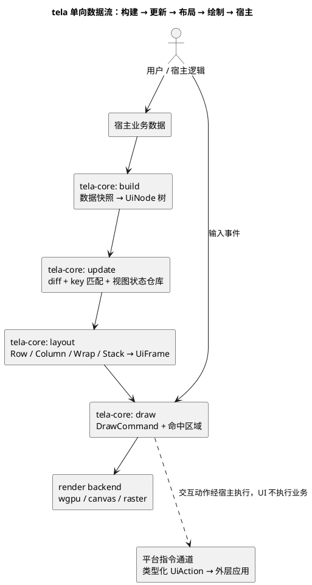

# 002-架构总览与分层

## 1. 分层

tela 按“契约 → 核心 → 原子组件 → 分子组件 → 适配/宿主”分层，依赖方向由外向内，核心不反向依赖任何后端。`tela-icon` 是为上层组件服务的受控资源/语义支路：它把图标降级为既有 core 原语，而不是在核心或 renderer 中增加图标节点类型。

```
┌───────────────────────────────────────────────────────────┐
│  平台 SDK / 应用适配（WebView、Win32、macOS、游戏、离线）     │
│  拥有窗口、事件循环、平台能力与业务副作用                    │
└───────────────▲───────────────────────▲───────────────────┘
                │ 窄输入/输出通道          │ 消费 UiFrame
┌───────────────┴──────────┐   ┌─────────┴───────────────────┐
│  app ABI / bundle / demo │   │  render（tela-render-*）     │
│  WebView / native SDK     │   │  wgpu / canvas / raster 后端 │
└───────────────▲──────────┘   └─────────▲───────────────────┘
                │                        │ 消费 UiFrame / DrawCommand
                │ 组合组件               │
┌───────────────┴────────────────────────┴───────────────────┐
│  tela-ui（Text/InlineSlot/IconButton、UiIntent、常见组合模式） │
└───────────────▲────────────────────────────────────────────┘
                │ 原子组件与受控值
┌───────────────┴────────────────────────────────────────────┐
│  tela-widgets（Button/Input/Checkbox、BindId、IME 适配）     │
└───────────────▲────────────────────────────────────────────┘
                │
┌───────────────┴────────────────────────┴───────────────────┐
│  core（tela-core，渲染器无关，纯 Rust）                      │
│  tree · layout · draw · interaction · identity · state      │
└───────────────▲────────────────────────────────────────────┘
                │ 依赖
┌───────────────┴────────────────────────────────────────────┐
│  contract（tela-contract，纯类型，零依赖）                   │
│  UiNode / NodeKind / LayoutConcern / VisualConcern          │
│  InteractConcern / IdentityConcern / ContentConcern         │
│  Size / BaseSize / MinMax / Constraints / LayoutBox         │
│  UiFrame（含 viewport）/ DrawCommand / HitRegion / ClipRect  │
│  TextMetrics / TextMeasurer / BackendCapabilities / UiAction│
│  KeyCombo / ShortcutId / RawKeyboardEvent / BindId          │
│  Viewport / ScrollState / SemanticKey / KeyStrategy / UpdateMode │
└────────────────────────────────────────────────────────────┘

受控字形支路（不参与 core 的依赖方向）：

tela-fonts（资源字节） -> tela-text（度量 / 基线 / 覆盖事件）
                              ^
                              └── tela-demo、tela-render-raster(std)、tela-render-wgpu

tela-icon（IconKey / provider / 光学度量） -> tela-core 的既有 Text / Image / 几何节点
        ^                                      ^
        └──────── tela-ui、tela-demo ──────────┘
```

### 各层职责

| 层 | 职责 | 允许依赖 | 禁止 |
|---|---|---|---|
| `tela-contract` | 纯类型：节点、样式、内容、布局结果、绘制命令、动作、宿主端口、策略枚举 | 无 | 任何逻辑、任何 crate |
| `tela-core` | 树构建与校验、更新策略与 diff、key 身份分配、单次测量布局原语（Row/Column/Wrap/Frame/Stack/Overlay 等）、绘制命令生成、命中测试、规约式焦点转移、模态栈、视图状态仓库 | `tela-contract` | `unsafe`、窗口/文件/网络/时间、平台 API |
| `tela-fonts` | 受控 UI / 图标字体名称与不可变字节 | 无 | UI 逻辑、字体解析、renderer 状态 |
| `tela-text` | 受控字体选择、em 缩放、纯度量、基线定位和字形覆盖事件 | `tela-contract`、`tela-fonts`、`ab_glyph` | `tela-core`、renderer、宿主状态、GPU/Canvas API |
| `tela-icon` | 图标语义键、provider、Material iconfont 映射与光学墨迹度量；降级为既有 `UiNode` | `tela-contract`、`tela-core`、`tela-fonts`、`tela-text` | renderer、宿主、widgets、demo；`NodeKind::Icon` / `DrawPayload::Icon` |
| `tela-render-*` | 消费 `UiFrame` 渲染：wgpu 后端、浏览器 canvas 后端、软件光栅后端；需要受控动态字形时消费 `tela-text` 覆盖事件 | `tela-contract`、`tela-text`（按后端/feature） | 反向依赖 core 逻辑、自行重算字体度量或基线 |
| `tela-widgets` | Button/Input/Checkbox 等原子控件、受控值、`BindId`、基础焦点与 IME 宿主适配 | `tela-contract`、`tela-core` | 图标来源、组合工作流、业务命令、领域样式 |
| `tela-ui` | Form/Table/Select/Cascader/Toolbar、`Text`/`InlineSlot`/`IconButton` 等主题无关分子组件；`UiIntent` | `tela-contract`、`tela-core`、`tela-widgets`、`tela-icon`、`tela-text` | renderer、平台 API、业务 Store、tela key 管理 |
| `tela-app-abi` | 应用 WASM 的版本化事件、状态、帧包协议；只传输已有 `UiFrame` 原语 | `tela-contract` | 平台窗口、GPU、业务副作用 |
| `tela-bundle` | 应用 WASM、资源与校验清单的可验证开发包 | `tela-app-abi` | 平台 API、业务逻辑 |
| `tela-webview-sdk` | WebView Rust 胶水：bundle/ABI 校验、事件 codec、`UiFrame` 解码与 canvas WGPU present；JavaScript 半边只管理 DOM/IME/fetch/lifecycle | ABI、bundle、contract、wgpu renderer、wasm-bindgen/web-sys | demo 业务状态、布局重算、跨平台巨型 Host 抽象 |
| 平台 SDK / 应用适配 | 拥有窗口、事件循环、IME/剪贴板等平台能力；翻译输入，消费帧，执行外部副作用 | 按平台需要依赖 ABI、bundle、renderer | 反向依赖 core 内部结构；抽象成全功能公共 `Host` trait |

> 分层的拆分判据：① 部件是否以不同速率演化；② 是否有独立验证单元；③ 是否暴露平台。都不满足就平铺，禁止为整洁而拆。

## 2. 数据流总览



规则一句话：**宿主拥有业务数据，基座只消费数据快照产生视图；视图变化与交互动作都通过类型化端口回到宿主，核心内无旁路副作用。**

## 3. 契约通道

| 通道 | 方向 | 形式 | 承载 |
|---|---|---|---|
| 类型契约 | 核心 ← 契约 | crate 依赖公开类型 | `UiNode`（五维度槽位）、`Constraints`/`LayoutBox`/`DrawCommand` |
| 数据快照入站 | core ← host | `build(snapshot)` 参数 | 业务数据投影，宿主所有 |
| 帧出站 | core → render | `UiFrame` 值 | 绘制命令序列 + 命中区域 |
| 动作出站 | core → host | `UiAction` 类型化事件 | 点击/输入/焦点/弹窗意图，宿主执行 |
| 平台能力边界 | 应用/组件 ↔ 平台 SDK | 场景需要的窄事件或能力通道 | IME、剪贴板、时钟、资源加载、视口信息 |

系统间可共享数据契约与端口，但绝不共享状态与实现。

## 4. crate 拆分建议（目标结构，阶段化落地）

```
tela-contract     纯类型契约（零依赖）
tela-core         树 · 身份 · 更新 · 布局 · 绘制 · 交互 · 视图状态
tela-fonts        受控 UI 与图标字体的名称/字节资源
tela-text         受控字体度量 · em 缩放 · 基线定位 · 字形覆盖事件
tela-icon         图标语义 · provider · 光学度量 · 既有原语降级
tela-render-raster 软件光栅基准后端（仅测试/CI/离线/服务端；无 GPU、no_std，输入只收 UiFrame）
tela-render-wgpu   wgpu 后端（游戏内嵌/贴图）
tela-render-canvas 浏览器 canvas 后端（wasm）
tela-app-abi      版本化 WASM 应用事件 / 状态 / 帧包协议
tela-bundle       WASM + 资源 + 完整性清单的开发包
tela-webview-sdk  浏览器 WebView 胶水（bundle/ABI/WGPU；JS DOM 半边在 web/）
tela-native-sdk-runtime  原生开发壳共享的 bundle / Wasmtime / 生命周期 runtime
tela-win32-sdk    Win32 开发壳（HWND + WGPU）
tela-macos-sdk    macOS 开发壳（AppKit + Metal/WGPU）
tela-widgets      原子组件与绑定输入（Button/Input/Checkbox、BindId、IME）
tela-ui           主题无关分子组件（Text/InlineSlot/IconButton、Form/Table/Select/Cascader/Toolbar、UiIntent）
```

- 阶段 1 建议先只建 `tela-contract` + `tela-core` + `tela-render-raster`，保证核心可在无窗口环境验证。
- `tela-text` 是字体字节与 renderer 之间的纯共享层：它有独立的单位测试价值，也把 demo、Raster、WGPU 对 `FontRef` 回退、em 缩放、折行和字形基线的解释固定为一份实现。
- `tela-render-raster` 的 `std` 路径依赖 `tela-contract` + `tela-text` + 基础 2D 数学；`no_std` 路径保留 `font8x8` 位图降级，**两条路径都禁止反向依赖 `tela-core`**；实现方案见 [007-绘制与渲染后端](007-绘制与渲染后端.md) 7。
- `tela-core` 保持零字形依赖：度量以 `TextMeasurer` 参数注入 resolve，字体资源和具体栅格化始终留在 `tela-text` / renderer 支路（见 [007-绘制与渲染后端](007-绘制与渲染后端.md) 4.0）。
- `tela-icon` 不把图标抽象泄漏进帧协议；首个 Material provider 降级为 `FontRef("tela-icons")` 文本节点，未来 provider 也必须输出已有原语或等待完整的跨后端向量原语。
- wgpu / canvas 后端在核心稳定后接入，各自独立验证单元。

## 5. 规则

- ✅ 依赖方向为“宿主 → 适配/分子组件 → 原子组件 → 核心 → 契约”；图标资源支路只向 `tela-core` 的已有原语降级。核心与渲染器的反向依赖、`tela-icon` 与 `tela-ui` 到 renderer/demo 的反向依赖，以及 `tela-webview-sdk -> tela-demo` 的反向应用依赖由 `ops check` 拦截。
- 🔧 核心 crate 不依赖任何后端，也不被任何后端反向依赖。
- 🔧 核心禁止 `unsafe`；平台能力经场景所需的窄通道接入，不建立全功能公共 `Host` trait。
- 🔧 新增 crate 必须满足拆分判据之一（不同演化速率 / 独立验证单元 / 暴露平台）。
- 🔧 Props 正交：节点按维度槽位拆分，各层只消费自己维度的槽位，见 [003-场景树与节点模型](003-场景树与节点模型.md)。
