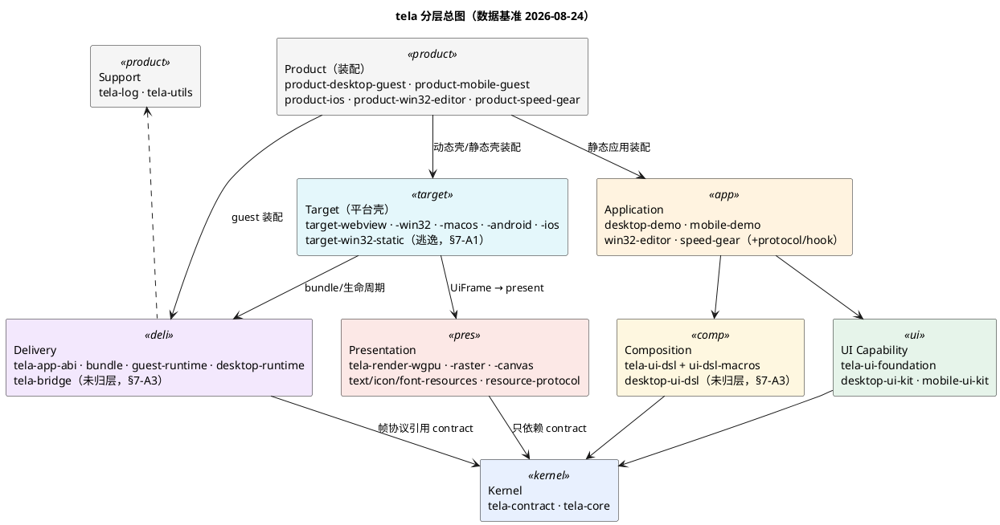
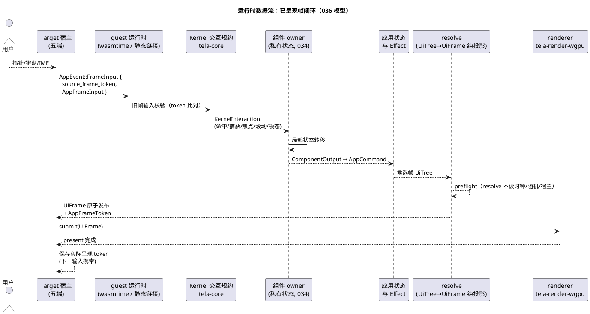
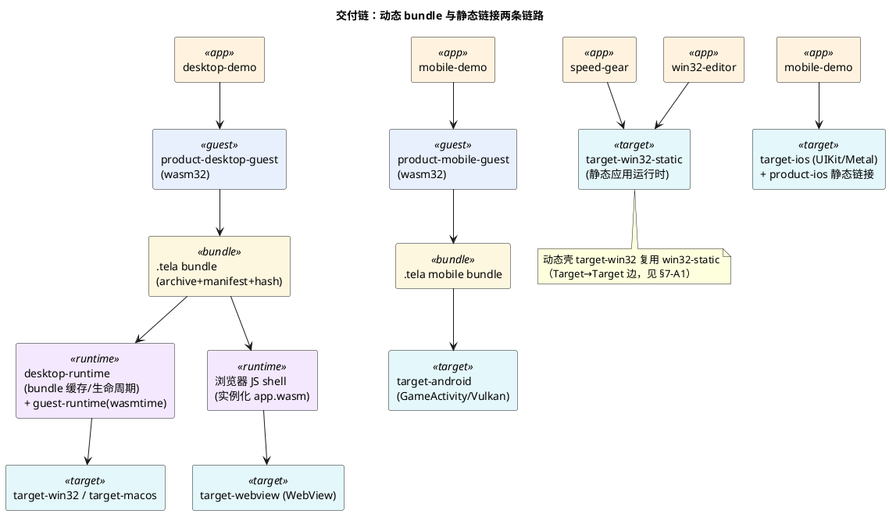
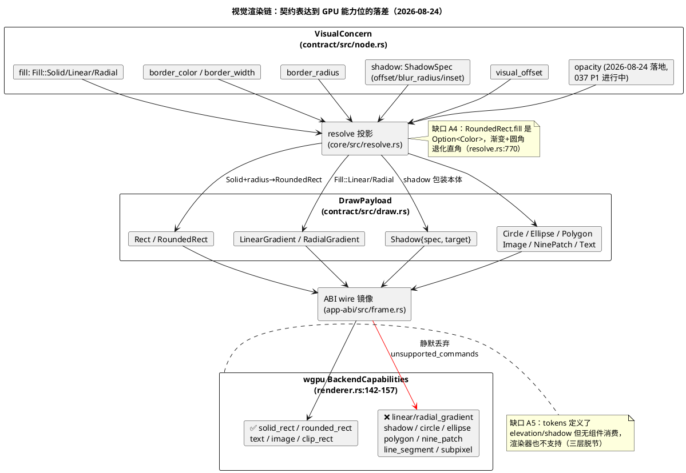

# 002-架构总览与分层

> 状态：**现状权威文档**。本文以源码为准（数据基准 2026-08-24，行号以当时代码为准，失真即改）。
> 历史 intent 文档 026（架构迭代方案）与 029（迁移记录）已删除：迁移已落地，意图由本文的现状与审计章节吸收。
> 依赖方向由 `ops check` 第四道门强制（规则源码：`ops/src/domain/architecture.ts`，以 `cargo metadata` 真实依赖树为数据源）。
>
> 再生成依赖数据：`cargo metadata --no-deps --format-version 1`。

## 1. 分层与 crate 归属

依赖方向总原则：**外层选择内层，内层不知道外层**。Product 装配完整链路；Target 只承载本地平台壳；
Kernel 与 UI Capability 不可反向认识 Presentation、Delivery、Target。

| 层 | crate | 职责 |
|---|---|---|
| **Kernel** | `tela-contract` | 纯类型契约（零依赖）：节点五维槽位、绘制命令、布局结果、能力集 |
| | `tela-core` | 树构建/校验、更新策略、key 身份、单次测量布局、resolve 投影、命中规约、视图状态仓库 |
| **UI Capability** | `tela-ui-foundation` | 主题 token、原子组件（Button/Input/Checkbox/Slider/Switch…） |
| | `tela-desktop-ui-kit` / `tela-mobile-ui-kit` | 双形态 Kit：桌面/移动组件目录与主题 |
| **Composition** | `tela-ui-dsl` + `tela-ui-dsl-macros` | 应用组合 DSL 运行时与派生宏 |
| | `tela-desktop-ui-dsl` *(未归层，见 §7-A3)* | 桌面形态 DSL 扩展 |
| **Presentation** | `tela-render-wgpu` | 唯一生产渲染后端（五端全部消费） |
| | `tela-render-raster` | 软件光栅（测试/CI/离线；已退出视觉基准角色，见 037） |
| | `tela-render-canvas` | Canvas2D trait 抽象（非生产路径） |
| | `tela-text-resources` / `tela-icon-resources` / `tela-font-resources` / `tela-resource-protocol` | 受控字体度量、图标 provider、字体字节、资源协议 |
| **Delivery** | `tela-app-abi` | 应用 WASM 版本化事件/状态/帧包协议（wire 镜像在 frame.rs） |
| | `tela-bundle` | `.tela` 可验证开发包（archive + manifest + hash 校验） |
| | `tela-guest-runtime` | Wasmtime 中性 guest：实例化、dispatch、frame 读取 |
| | `tela-desktop-runtime` | 桌面壳共享的 bundle 缓存与生命周期 runtime |
| | `tela-bridge` *(未归层，见 §7-A3)* | 宿主桥（device/position/config 能力提供方） |
| **Target** | `tela-target-webview` / `-win32` / `-macos` / `-android` / `-ios` | 平台壳：窗口、事件循环、present、平台输入 |
| | `tela-target-win32-static` *(逃逸管辖，见 §7-A1)* | Win32 静态应用运行时（session 内嵌 Kernel/DSL），被动态壳 win32 复用 |
| **Application** | `tela-desktop-demo` / `tela-mobile-demo` | 文件管理器演示（动态 guest 应用） |
| | `tela-win32-editor` / `tela-speed-gear` | Win32 静态应用 |
| | `tela-speed-gear-protocol` / `tela-speed-gear-hook` *(未归层，见 §7-A3)* | 变速齿轮应用族：注入协议 + Windows hook DLL |
| **Product** | `tela-product-desktop-guest` / `-mobile-guest` | 动态 guest 装配（wasm + 资源 → bundle 候选） |
| | `tela-product-ios` | iOS 静态装配（不进 bundle 协议） |
| | `tela-product-win32-editor` / `-speed-gear` | Win32 静态应用装配 |
| **Support** | `tela-log` / `tela-utils` | 纯日志 facade、通用工具（零业务） |

## 2. 分层总图



## 3. crate 依赖图（cargo metadata 实测）

实线 = normal 依赖，虚线 = dev 依赖，**红色 = 腐化边（§7 审计）**。

```plantuml
@startuml{002-deps}
title tela crate 依赖图（cargo metadata --no-deps，2026-08-24）
skinparam shadowing false
skinparam linetype ortho
left to right direction

package "Kernel" {
  rectangle "contract" as contract
  rectangle "core" as core
}
package "Support" {
  rectangle "log" as log
  rectangle "utils" as utils
}
package "UI Capability" {
  rectangle "ui-foundation" as uif
  rectangle "desktop-ui-kit" as duk
  rectangle "mobile-ui-kit" as muk
}
package "Composition" {
  rectangle "ui-dsl" as uidsl
  rectangle "ui-dsl-macros" as uidslm
  rectangle "desktop-ui-dsl" as dudsl
}
package "Presentation" {
  rectangle "render-wgpu" as wgpu
  rectangle "render-raster" as raster
  rectangle "render-canvas" as canvas
  rectangle "text-resources" as text
  rectangle "icon-resources" as icon
  rectangle "font-resources" as fonts
  rectangle "resource-protocol" as resproto
}
package "Delivery" {
  rectangle "app-abi" as abi
  rectangle "bundle" as bundle
  rectangle "guest-runtime" as guest
  rectangle "desktop-runtime" as drt
  rectangle "bridge" as bridge
}
package "Target" {
  rectangle "target-webview" as tweb
  rectangle "target-win32" as twn
  rectangle "target-win32-static" as twns
  rectangle "target-macos" as tmac
  rectangle "target-android" as tand
  rectangle "target-ios" as tios
}
package "Application" {
  rectangle "desktop-demo" as ddemo
  rectangle "mobile-demo" as mdemo
  rectangle "win32-editor" as wedit
  rectangle "speed-gear" as sgear
  rectangle "speed-gear-protocol" as sproto
  rectangle "speed-gear-hook" as shook
}
package "Product" {
  rectangle "product-desktop-guest" as pdg
  rectangle "product-mobile-guest" as pmg
  rectangle "product-ios" as pios
  rectangle "product-win32-editor" as pwedit
  rectangle "product-speed-gear" as psg
}

core --> contract
uif --> contract
uif --> core
duk --> contract
duk --> core
duk --> uif
muk --> contract
muk --> core
muk --> uif
uidsl --> contract
uidsl --> core
uidsl --> uidslm
dudsl --> contract
dudsl --> duk
dudsl --> uidsl
dudsl --> uif
wgpu --> contract
wgpu --> log
wgpu --> text
raster --> contract
raster --> text
raster ..> core : dev
canvas --> contract
text --> contract
text --> fonts
icon --> contract
icon --> text
abi --> contract
bundle --> abi
guest --> abi
guest --> bridge
guest --> bundle
guest --> contract
drt --> bridge
drt --> bundle
drt --> guest
drt --> utils
drt ..> abi : dev
bridge --> utils
tweb --> abi
tweb --> bundle
tweb --> contract
tweb --> wgpu
twn --> abi
twn --> bridge
twn --> contract
twn --> drt
twn --> wgpu
twn --> twns
tmac --> abi
tmac --> bridge
tmac --> contract
tmac --> drt
tmac --> wgpu
tand --> abi
tand --> contract
tand --> guest
tand --> log
tand --> wgpu
tios --> contract
tios --> wgpu
twns --> bridge
twns --> contract
twns --> wgpu
twns -[#red]-> core : A1
twns -[#red]-> drt : A1
twns -[#red]-> uidsl : A1
ddemo --> contract
ddemo --> core
ddemo --> dudsl
ddemo --> duk
ddemo --> uidsl
ddemo --> uif
ddemo ..> icon : dev
ddemo ..> raster : dev
ddemo ..> text : dev
mdemo --> contract
mdemo --> core
mdemo --> muk
mdemo --> uidsl
mdemo --> uif
mdemo ..> icon : dev
mdemo ..> raster : dev
mdemo ..> text : dev
wedit --> bridge
wedit --> contract
wedit --> core
wedit --> icon
wedit --> uidsl
wedit --> uif
wedit -[#red]-> twns : A2
wedit ..> raster : dev
wedit ..> text : dev
sgear --> contract
sgear --> core
sgear --> dudsl
sgear --> duk
sgear --> sproto
sgear --> uidsl
sgear --> uif
sgear -[#red]-> twns : A2
sgear ..> icon : dev
sgear ..> text : dev
shook --> sproto
pdg --> abi
pdg --> bridge
pdg --> contract
pdg --> ddemo
pdg --> icon
pdg --> text
pmg --> abi
pmg --> contract
pmg --> icon
pmg --> mdemo
pmg --> text
pios --> contract
pios --> icon
pios --> mdemo
pios --> tios
pios --> text
pwedit --> contract
pwedit --> drt
pwedit --> icon
pwedit --> text
pwedit --> utils
pwedit --> wedit
pwedit --> twns
psg --> contract
psg --> icon
psg --> sgear
psg --> text
psg --> twns
@enduml
```



再生成命令（normal/dev 分离）：

```bash
cargo metadata --no-deps --format-version 1 | python3 -c "
import json,sys
m=json.load(sys.stdin)
for p in sorted(m['packages'], key=lambda x:x['name']):
    tela=lambda d: d['name'].replace('tela-','')
    normal=sorted(tela(d) for d in p['dependencies'] if d['kind'] is None and d['name'].startswith('tela'))
    dev=sorted(tela(d) for d in p['dependencies'] if d['kind'] in ('dev','build') and d['name'].startswith('tela'))
    n=p['name'].replace('tela-','')
    print(f'{n} | N: {\" \".join(normal) or \"-\"} | D: {\" \".join(dev) or \"-\"}')"
```

## 4. 运行时数据流

事件系统以 [036-事件系统与组件生命周期机制梳理](036-事件系统与组件生命周期机制梳理.md) 为权威约束；
本图是其在当前代码中的实际路径（`app-abi/src/event.rs`）。



要点（036 红线，当前代码均已满足）：

- `resolve` 是纯投影：不读时钟、随机数、宿主对象（`core/src/resolve.rs`）；
- 布局缓存按子树指纹命中，Dirty 更新复用未变子树（`core/src/update.rs` 指纹缓存）；
- 037 动画方案沿用本闭环：宿主只发 `Tick`（带时间戳），插值在 guest 侧完成，Kernel 保持无时钟。

## 5. 交付链



| 链路 | 应用 | 交付物 | 宿主 |
|---|---|---|---|
| 桌面动态 | desktop-demo | `.tela` bundle | win32 / macos（desktop-runtime + wasmtime） |
| 浏览器 | desktop-demo | 同一 `.tela` bundle | webview shell（浏览器直接实例化 app.wasm） |
| 移动动态 | mobile-demo | 独立 mobile bundle | android（GameActivity/Vulkan） |
| iOS 静态 | mobile-demo | 无 bundle，Xcode 静态链接 | ios（UIKit/Metal） |
| Win32 静态 | speed-gear / win32-editor | 无 bundle，静态链接 | win32-static |

## 6. 视觉渲染链现状（037 起点）



此图是 [037-视觉保真与微交互动画实施目标](037-视觉保真与微交互动画实施目标.md) 的现状锚点：
契约与投影已就绪，**唯一缺口在 wgpu 能力位**（12 位中 4 位为 true）。

## 7. 腐化审计（只记录，不处置）

数据基准 2026-08-24。以下各条均有源码证据；处置建议另行立项，本文只保证漂移可见。

| # | 腐化 | 证据 | 若纳入管辖的后果 |
|---|---|---|---|
| A1 | **win32-static 逃逸 Target 管辖**：`TARGET_CRATES` 枚举不含它（`architecture.ts:246-252`），全部 Target 规则失效；实际依赖 core（Kernel）+ ui-dsl（Composition）+ desktop-runtime（Delivery）+ bridge，且被动态壳 target-win32 复用（Target→Target） | `crates/targets/win32-static/Cargo.toml:11-13`；`session.rs:15` 直接 `use tela_core::{UiTree, ViewStateStore}`；2608 行准运行时 | 归层 Target 立刻 3+ 条违规 |
| A2 | **Application→Target 无门禁**：speed-gear、win32-editor（normal）依赖 target-win32-static；架构意图是"Product 选择 Target"，但 Application 层只有被依赖侧禁令，无出边规则 | `apps/speed-gear/Cargo.toml:19`、`apps/win32-editor/Cargo.toml:17` | 违反 026 意图，门禁不拦 |
| A3 | **5 个 crate 未归层**：desktop-ui-dsl（Composition）、bridge（Delivery）、speed-gear-protocol/hook（Application 族）不在任何层枚举里，层规则对它们不存在 | `architecture.ts:265-288` 层枚举 | 归属靠人记，新 crate 默认逃逸 |
| A4 | **契约缺口**：RoundedRect.fill 是 `Option<Color>` 装不下渐变 → 渐变+圆角退化直角；Image 无 radius。~~无 opacity 槽位~~ → opacity 已于 2026-08-24 落地（`draw.rs:56`、`node.rs:473`，037 P1 进行中，wgpu 能力位尚未接线） | `resolve.rs:770-786`；`draw.rs:70-77,102-105` | 037 P1 修复项 |
| A5 | **三层脱节 + 文档虚标**：tokens 定义 elevation/shadow（`ui/foundation/src/tokens.rs:130-154`）无组件消费；docs/007 §6.1 虚标渐变已实现，代码 `linear_gradient: false`（`renderer.rs:148`） | 全 apps 0 处 `Fill::Linear/Radial/Shadow` 使用 | 037 P0/P1 修复项 |

**腐化机理**：门禁是"名单制"而非"原则制"——`ALLOWED_NORMAL` 随 PR 只增不减，层成员靠手工枚举，
漏登一个 crate 即永久失守。win32-static 从实验壳长成 2608 行运行时即是实例。

## 8. 规则（延续并更新）

- ✅ 依赖方向"Product → Target/Delivery → Kernel ← UI/Composition/Presentation"；由 `ops check` 第四道门以 `cargo metadata` 真实依赖树强制。
- ✅ Kernel（contract/core）无时钟、无随机、无宿主对象读取；`unsafe_code = "forbid"`（workspace 级）。
- ✅ Renderer 生产闭包禁止反向依赖 tela-core（dev 测试例外）。
- ✅ UI Capability 禁止依赖 Composition、Renderer、Delivery、Target、Application、Product。
- ✅ Target 只承载本地平台，禁止静态依赖 Application/Product，禁止依赖其他 Target 与 Composition。
- ✅ 文字度量是同一不可变字体数据的纯函数（`tela-text-resources`），renderer 不得重新解释字体/em/基线（见 [007-绘制与渲染后端](007-绘制与渲染后端.md) 4.0）。
- 🔧 新增 crate 必须满足拆分判据之一（不同演化速率 / 独立验证单元 / 暴露平台），且**必须同时归层**（§7-A3 的教训）。
- 👁 本文的图与 §7 审计随代码演进失真即改；依赖图以 §3 再生成命令输出为准。
