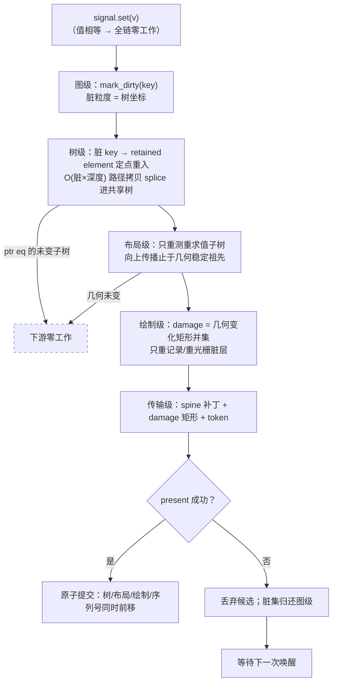

# 渲染管线：脏的传导与身份缓存

> 一次更新的全部工作，是让"脏"沿管线逐级传导并衰减——**key（图）→ 路径（树）→ 子树（布局）→ 矩形（绘制）→ 增量（传输）**。每一级只消费身份，每一级的输出脏集是下一级的输入。

本文是 [001-响应式核心抽象](./001-响应式核心抽象：边、坐标与身份.md) 的续篇：001 回答"变化怎么被发现"（图与边），本文回答"发现之后，响应的工作怎么做到最少"。沿用同一条哲学：**一切复用皆身份匹配，"没变"永远是指针/身份事实，从不是内容比较的结论。**

> **状态声明**：本文是目标态规范（normative），不是现状描述。当前实现与本文的逐条差距见附录一，归位路径统一为路线 P3。

---

## 1. 核心命题：脏的传导

业界把响应管线的性能架构总结为三层配方（①失效 / ②范围遍历 / ③分层缓存）。在 tela 的抽象下，这三层收敛为**同一个机制在四种粒度上的展开**：

| 级 | 脏的粒度 | 这一级做的事 | 输出给下一级 |
|---|---|---|---|
| 图 | `SemanticKey`（树坐标） | 边传播：signal 写入标脏 key | 脏 key 集 |
| 树 | 脏路径（spine） | 定点重求值：脏 key → retained element 重入 → 路径拷贝拼接 | 重求值的子树集 |
| 布局 | 子树 | 只重测重求值的子树；向上传播止于"尺寸未变" | 尺寸/位置变化的矩形 |
| 绘制 | 矩形（damage） | 只重绘 damage 并集覆盖的层 | 脏层/脏矩形 |
| 传输 | 增量 | 只发送脏路径补丁 + damage 矩形 | — |

两条铁律贯穿每一级：

1. **只消费身份**：判断"没变"用指针相等 / key 相等 / 脏位——没有任何一级做内容比较（diff / 指纹）。
2. **脏集即接口**：每一级的输出就是下一级的输入，不需要任何一级重新"发现"变化。发现只发生一次（在图上，001 的领域），之后全是执行。

推论：每一级的工作量都与 UI 总规模无关，只与脏的量级成正比——`O(脏×深度)`、`O(重求值子树)`、`O(damage 面积)`、`O(增量字节)`。

## 2. 共享树：唯一的物理结构

整条管线的地基是一棵 **Rc 共享的不可变节点树**：

- 更新 = 沿脏路径重求值 + **O(深度) 路径拷贝**（spine 上每层换新节点，指向未变孩子的旧 Rc）。
- "没变" = 孩子指针相等（ptr eq）。retained 命中拼接的就是原来的那颗子树——身份天然延续，下游任何一级零工作。
- 没有克隆、没有指纹、没有"重建后与新树对账"：**树本身就是缓存**，每级把各自的记忆（布局结果、绘制层、序列化字节）记在节点身份上。

这与持久化数据结构（persistent data structure）同构：结构性共享使"版本间的差"就是路径本身。

## 3. 树级：定点重求值

脏 key 即树坐标（001：订阅绑定 `(key, signal_id)`，脏标天生携带位置）。树级消费它：

```
脏 key → 逆映射到责任 retained element（最外层脏者优先，嵌套脏被外层吸收）
      → 该 element 独立重入（自包含：输入边 + 坐标 + 求值器）
      → 新输出 splice 进共享树：O(深度) 路径拷贝
      → root 全量路径仅保留给结构变化与宿主失效（逃生口）
```

要点：**父与子解耦**——子 element 的重入判定只看自己的边与脏集（001 §8.4 的冻结保证）；脏在祖先缓存子树内则祖先同帧重求值，同级的干净兄弟零工作。参照系是 Flutter 的脏 Element 列表（深度排序单趟、父吸收子），但 tela 不需要列表排序：坐标直达，天然无序。

## 4. 布局级：身份记忆 + 尺寸边界

布局结果记忆在**节点身份**上：

- splice 进来的未变子树 = 同一指针 → 布局记忆直接命中，零重测。
- 只有重求值的子树重新布局。重求值不必然尺寸变化——**布局输出的脏以"尺寸/位置是否变化"为准**，与输入的脏解耦：重求值但几何未变，则对下游是零。
- **向上传播的边界 = 第一个几何稳定的祖先**（子尺寸没变，父的布局输入就没变，传播终止）。这是 Flutter relayout boundary 的对应物，但判定同样是身份级：比较新旧尺寸（O(1)），不是比较子树内容。

**脏的种类必须区分：几何脏 ≠ 视觉脏。** 几何稳定只阻断*重测*的向上传播，**绝不阻断绘制 damage 的产生**——背景色变化几何未变，布局级零重测，但它必须作为视觉脏把矩形交给绘制级。每一级携带的脏集是带种类的（`DirtyFlags`：几何 / 视觉 / 结构），而非单一布尔。

**几何回读是跨帧反馈，不是图内同帧边。** 注意区分三类几何信息：**滚动/拖拽偏移不是"回读"**——它们是宿主输入态（view_state），当帧在 emit 阶段消费（`child_offset = base - scroll.offset`），不经过 build、不存在下一帧延迟，交互跟手；**"测量后决策"类自适应（贴边防溢出、intrinsic 尺寸、容器查询式条件）属于布局阶段内部逻辑**——容器调度器"先测子再定父"本就是同帧决策（Flutter 布局委托、CSS container query 同理），不走图的回读；只有**应用逻辑对几何的响应**（滚动到底加载、可视性驱动）跨帧——与 web 的 `ResizeObserver` 同构（布局后异步派发，settle-then-decorate 场景一帧无感）。把它建模为 `Computed<Size>` 之类的同帧边会形成 build→layout→signal→build 反馈环——这正是收敛循环存在的原因。正确形态：布局产物作为**下一帧**的宿主态输入（FrameContext / scroll_bounds 模式），帧间传播，帧内无环。**配套要求**：布局阶段必须提供足够富的自适应原语（flip-to-fit、intrinsic sizing、容器查询类条件布局），否则开发者会被迫用跨帧回读解同帧布局问题。

## 5. 绘制级：damage 与层缓存

- **damage = 重求值且输出实际变化的子树矩形并集**（几何或视觉任一变化都算），不是几何变化的子集——否则纯视觉变化永远不会到屏。布局级的"几何稳定止步"只省测量，不省 damage。
- 只重新记录/光栅化 damage 覆盖的绘制层；未触及的层（光栅缓存按层身份持有）零工作。
- 层的划分以身份稳定为前提（同一子树 → 同一层），滚动/平移类变化优先走"层变换"（改偏移不动纹理），其次才重光栅。
- 绘制级的输出：脏层 + 脏矩形（带种类）——这是传输级的输入。

## 6. 传输级：增量协议

跨进程/跨 GPU 边界（webview target）传输的不是一个"帧"，而是：

```
{ base_seq（基于的已确认帧序号）+ spine 补丁 + damage 矩形 + 新帧 token }
```

协议采用 **latest-wins + ack 增量**：

- 信道为有序可靠（WebSocket / postMessage），丢包乱序本不发生；真实场景是**慢消费者 + 帧合并**——中间帧天然可跳（UI 是收敛语义，最新者胜），跳过的帧不补发。
- 接收端对成功应用的补丁回 **ack 序号**；发送端保留最近 N 个版本的共享树，从接收端 ack 的最近公共版本计算增量（共享树使 diff 就是身份级路径比对，非内容比较）。
- 仅当 ack 落出保留窗口（消费者落后太多）才发送一次整帧快照重同步——整帧是窗口外的兜底，不是常态路径，不会在高负载下雪崩为反复全量。
- token 的职责是**顺序与输入溯源**（旧帧事件拒绝），不是省传输。
- 接收端按 damage 局部更新；未命中的纹理/层直接复用。

## 7. 事务：脏集的原子性

管线各级都工作在**候选**上，横跨一致：

- 候选 = 旧共享树 + 脏路径上的新 spine（O(脏×深度) 的构建本身就是轻量的）+ 各级候选记忆（布局/绘制增量）。
- present 成功 → 原子切换 active（树、布局记忆、绘制层、传输序列号同时前移）。
- present 失败 → 丢弃候选，**脏集回滚到图级**（恢复脏标，等待下一次唤醒）——变化不会被丢失，只是延迟。

事务边界与脏的传导同构：候选携带自己的脏集，提交即消费，失败即归还。

## 8. 管线总图



每一级右侧的逃逸线（"未变即零工作"）就是身份缓存的意义：**脏在传导中只减不增，任何一级都可能把它归零。**

## 9. 量级账本

| 级 | 工作量 | 与 UI 总规模的关系 |
|---|---|---|
| 图 | O(脏) 边传播 + O(值) 写短路 | 无关 |
| 树 | O(脏 × 深度) 路径拷贝 | 无关 |
| 布局 | O(重求值子树)；边界检查 O(脏路径) | 无关 |
| 绘制 | O(damage 面积 / 脏层数) | 无关 |
| 传输 | O(增量字节) | 无关 |

全链路与 UI 总规模解耦——这是"O(变化)"在管线意义上的完整含义。

## 附录：与现状实现的关系

现状（写作时）与本命题的对照，差距集中在四处，归位路径均为 P3：

| 命题 | 现状 | 差距 |
|---|---|---|
| 树级定点重求值 | 从根行走；retained 命中是组件级近似 | P3 脏坐标重入 |
| 布局记忆按身份 | `LayoutCache`（kernel `update.rs`）按 `SemanticKey` 缓存整棵子树盒子树，但 key 的匹配靠**子树内容指纹**（FNV 哈希 kind + 全部几何 + 文本/图像内容 + 递归子孙；脏路径上每节点重算 O(子树)，指纹本身无缓存）——值语义克隆丢失了"没变"的身份信息，被迫内容证明。另：叶子测量的 `MeasureCache`（kernel `layout.rs`）以**裸指针 + 约束位**为键——引擎每次 resolve 新建、候选树全程存活，今天无地址复用风险，但 P3 子树跨帧拼接前必须改为**整形输入内容键**（文本+字体+字号+约束，天然跨帧安全且可跨帧命中文本整形） | Rc 共享树后退化 ptr eq；MeasureCache 改内容键 |
| 布局向上传播止于几何稳定祖先 | **无边界，无条件冒泡到根**：父指纹包含全部子孙，任何叶子变化使整条祖先链重测（m5_update：改一个文本重测"根 + 容器 + 文本"三级）；未变兄弟靠缓存命中 | §4 是设计目标 |
| 绘制 damage / 传输增量 | 全部整帧：emit 全量重跑、编码整帧二进制（`TLFR` v2）、JS 每帧整包 `render_gpu`、wgpu `Clear` 后重画全部命令；win32 壳 `InvalidateRect(None)` 整窗失效、macOS 忽略系统 dirty_rect。`frame_token` 三重身份（帧身份/输入溯源/去重 ack）但**不是内容增量** | §5/§6 是设计目标 |

现状里已与命题一致的部分（无需归位）：指纹**不哈希** `visual`/`interact`——hover 换色、普通滚动偏移零重测（滚动只在 emit 消费），这条"视觉与几何分离"正是 §4 的雏形；`UpdateMode::Full/Dirty` 的"Full 与 Dirty 渲染结果一致"不变量（m5_update 锁定）与 §7 的事务语义同源。

详见 [001 §7](./001-响应式核心抽象：边、坐标与身份.md) 路线。

## 附录二：最优性边界

**下界判据**（增量计算理论）：一次更新不可省略的工作 = **读全部变化的输入 + 写全部受影响的输出**，其余皆松弛（slack）。按此尺子逐级对账：

| 级 | 本设计 | 相对下界 |
|---|---|---|
| 发现 | 显式声明，零发现成本 | ✓（自动追踪系统在此付运行时发现费） |
| 比较 | 全身份级 | ✓（内容比较系统在此付费） |
| 遍历 | O(脏×深度)，路径上皆真受影响者 | ✓（O(深度) 指针写可忽略） |
| 布局 | 只重测真受影响子树，几何稳定即止 | ✓ |
| 传输 | O(增量字节) | ✓ |

**"最优"的准确含义：从不比变化的真相更贵。** 全局变化（根字号、viewport）时 O(n) 不是浪费——那是真相本身的价格，系统只是正确地把它传导了下去。

### 剩余差距（保留模式内仍未到下界的部分）

1. **重执行粒度是组件级，不是绑定级——最大的一块。** 组件读 3 个 signal、其中 1 个变了：整个 view 体重跑，含那 2 个未变的读取。表达式级粒度（模板静态部分零重执行、只重算触到变化信号的绑定）才是重执行的下界，归位路径是路线 3B（模板化 + 绑定级更新）。这是组件模型对模板模型的固有差，非实现瑕疵。
2. **"输入变了但输出恰好没变"必须重算才能知道。** 这不是松弛，是下界本身（不算就不知道）；几何稳定边界保证其下游代价被吸收到零。任何系统皆然，包括 Solid。
3. **damage 是保守包围盒并集。** 重叠区域的 overdraw 是启发式上界，非严格最小重绘——浏览器同样如此。

### 两个正交提醒

- **保留模式的本质交易：O(n) 内存换 O(变化) 时间。** 树与各级身份缓存随 UI 规模线性增长。对 UI 这是正确的交易（内存便宜、变化局部），但它是这个"最优"的定价方式。
- **立即模式（ImGui 方向）不是更优**：每帧全量重执行 = 永远 O(n)，只在"整帧便宜到无所谓"的工具级 UI 成立；在"变化局部"的前提下，保留模式 + 身份缓存 + 脏传导严格占优。

**结论：001+002 把保留模式推到了增量计算的下界上——除了一块（绑定级粒度，3B）与两个启发式常数（包围盒、重算后才知道没变）。3B 之后，剩余全部是下界本身；到那时再问"还能更快吗"，答案只会是"变化的真相就这么大"。**
