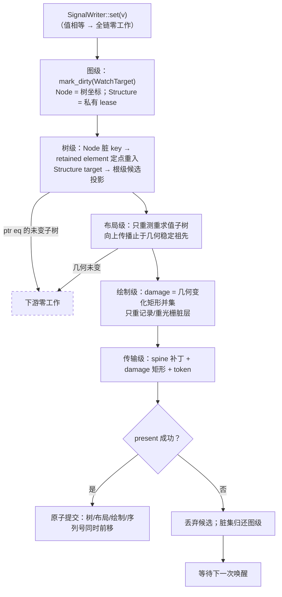

# 渲染管线：脏的传导与身份缓存

> 一次更新的全部工作，是让"脏"沿管线逐级传导并衰减——**key（图）→ 路径（树）→ 子树（布局）→ 矩形（绘制）→ 增量（传输）**。每一级只消费身份，每一级的输出脏集是下一级的输入。

本文是 [001-响应式核心抽象](./001-响应式核心抽象：边、坐标与身份.md) 的续篇：001 回答"变化怎么被发现"（图与边），本文回答"发现之后，响应的工作怎么做到最少"。沿用同一条哲学：**一切复用皆身份匹配，"没变"永远是指针/身份事实，从不是内容比较的结论。**

> **状态声明**：本文是目标态规范（normative），不是现状描述。当前实现与本文的逐条差距见附录一，归位路径统一为路线 P3。
>
> **2026-08-31 实现检查点**：Output 批次、候选 State/lease 回滚和显式 watch 的版本复核已经接入。P3 已实现 retained 脏根的独立重入、`Rc` spine 拼接，以及物化 child 槽位的最深优先重入：dirty child 先更新父 `MemoEntry` 的候选槽位，最后只 splice 最外层根。静态呈现 sidecar、HostInput / Parent Event 路由和按组件 scope 归属动画调度也随候选重建；树外存活路由会在候选树上重新解析，active 路由直到提交前不变。`Children` 现在是按实际消费的默认/命名结构边：derive `view` 只有调用 `children.build(build)` 或 `children.build_named(name, build)` 才装配并登记对应孩子，retained 重入也仅在同一调用点恢复物化快照；停止消费会从候选 memo 中移除旧条目并回退根级结构对账。透明 `For` / `Show` / `Switch` 的直接 `Signal` / `Computed` source 也已接通：它们以私有 lease 作为结构 dirty target，候选失败会归还该 target，提交后才替换或注销订阅；`Switch` 以命名 `branch` / `render` 函数选择稳定分支身份，宏不识别 `match` 或 `<Case>`。由于这些 target 没有物理树坐标，始终回退根级候选投影。静态 binding 可与 retained 重入合入同一候选：嵌套 target 按最深到最浅投影，同坐标 retained watch 先重入再把 binding 同步到新根；恢复 child 快照内的 binding 仍以未 prime 候选值同步当前 source。Host 投影会与这些可选择的 binding/retained 候选共享一次 resolve；没有独立 retained 根的普通 watch、重入后目标无法解析、结构变化、全局 viewport 变化及不满足窄候选条件的图脏边仍回退根级候选投影。P5 已实现组件声明的静态 `BindingSlot` 和候选化 `StaticBindingSelector`：它们在候选 `NodePresentation` 副本上写入，按 `VISUAL`/`GEOMETRY` 传给既有 layout/paint 管线，并在 `presented(token)` 后随候选 `RenderPlan` 发布；选择器只在成功提交后更换活跃分支订阅。它们不是新的跨进程字段补丁协议，也不把任意模板表达式自动转成 binding。布局缓存、几何稳定边界、WGPU damage 重绘和 ACK-base transport patch 也已有实现，附录保留的是尚未到下界的范围，而不是旧版本的“全部整帧”描述。
>
> **P4 追加检查点**：`FrameCoordinator::prepare_host_projection` 已能从 active 共享树、route、lease、owner 与 presentation 快照构造纯 Host 候选；scroll/focus/window 的投影变化会 resolve/present 新帧但不重跑 controller 根 render。普通 reject 和 `presented` 时发现显式 source 已过期都会保留 active 状态、把候选 HostState 与 host damage 重新暂存；待发布帧还记录自己是否由根装配产生，因此 Host/retained/presentation 候选可按原窄路径重试，只有根候选才重新执行 controller render。viewport、hover、pressed、focus、动画时钟、窗口最大化、当前模态栈顶和按 scroll key 的 `ScrollState` 均由 Host 私有 writer 管理，并只以只读 `Signal` 进入 `FrameContext`；用于 reconcile 收敛的值快照保持 runtime 私有，controller 没有旁路读取。卸载容器对应的 source 在成功提交后回收。scroll 的 HostInput 会携带其 `SemanticKey` 和 `VISUAL` 脏标记，profile 因而把 damage 限于已提交滚动视口；焦点变化同样携带旧/新焦点 key，且 profile 把焦点环描边外沿并入对应坐标，所以两端均可解析时只重绘这两个区域。未知、卸载或 teleport 坐标仍回退整视口；窗口和模态投影也仍保守取全视口。Host-only、retained-only 和 binding-only 都走各自窄路径；Host 投影与图脏边同帧时，运行时优先选择现有 binding 或可独立重入的 retained 候选树，并在同一次 resolve 中加入 candidate HostState 与 host damage，因而不需要合并两张 prepared tree，也不因混合输入强制根装配。若图脏边不具备 binding/retained 所要求的可证明所有权与树坐标，才回到根候选；这保持事务原子性，也不为普通 Host snapshot 保留兼容。

---

## 1. 核心命题：脏的传导

业界把响应管线的性能架构总结为三层配方（①失效 / ②范围遍历 / ③分层缓存）。在 tela 的抽象下，这三层收敛为**同一个机制在四种粒度上的展开**：

| 级 | 脏的粒度 | 这一级做的事 | 输出给下一级 |
|---|---|---|---|
| 图 | `WatchTarget` | `Node(SemanticKey)` 边传播为树坐标；透明结构 source 使用私有 `Structure(ComponentLease)` | 带 target 种类的 dirty 集 |
| 树 | 脏路径（spine）或结构失效 | Node target 定点重入并路径拷贝；Structure target 从根重新装配 | 重求值的子树集或新的结构候选 |
| 布局 | 子树 | 只重测重求值的子树；向上传播止于"尺寸未变" | 尺寸/位置变化的矩形 |
| 绘制 | 矩形（damage） | 只重绘 damage 并集覆盖的层 | 脏层/脏矩形 |
| 传输 | 增量 | 只发送脏路径补丁 + damage 矩形 | — |

两条铁律贯穿每一级：

1. **只消费身份**：判断"没变"用指针相等 / key 相等 / 脏位——没有任何一级做内容比较（diff / 指纹）。
2. **脏集即接口**：每一级的输出就是下一级的输入，不需要任何一级重新"发现"变化。发现只发生一次（在图上，001 的领域），之后全是执行。

推论：每一级的工作量都与 UI 总规模无关，只与脏的量级成正比——`O(脏×深度)`、`O(重求值子树)`、`O(damage 面积)`、`O(增量字节)`。

## 2. 共享树：唯一的物理结构

整条管线的地基是一棵 **Rc 共享的不可变节点树**：

- 更新 = 沿脏路径重求值 + **O(深度) 路径拷贝**（spine 上每层换新节点，指向未变孩子的旧 Rc）。
- "没变" = 孩子指针相等（ptr eq）。retained 命中拼接的就是原来的那颗子树——身份天然延续，下游任何一级零工作。
- 没有克隆、没有指纹、没有"重建后与新树对账"：**树本身就是缓存**，每级把各自的记忆（布局结果、绘制层、序列化字节）记在节点身份上。

这与持久化数据结构（persistent data structure）同构：结构性共享使"版本间的差"就是路径本身。

## 3. 树级：定点重求值

普通 Node dirty key 即树坐标（001：订阅绑定 `(key, signal_id)`，脏标天生携带位置）。树级消费它：

```
脏 key → 逆映射到责任 retained element（最外层脏者优先，嵌套脏被外层吸收）
      → 该 element 独立重入（自包含：输入边 + 坐标 + 求值器）
      → 新输出 splice 进共享树：O(深度) 路径拷贝
      → root 全量路径仅保留给结构变化与宿主失效（逃生口）
```

透明 `Show` / `For` / `Switch` 的直接 source 属于明确的结构失效，不是失败的 Node dirty。它的 watch target 是该结构实例的完整私有 lease；空列表、没有选中分支或将被卸载的子树都不需要也不能提供替身节点。树级看到此 target 时直接选择根级候选投影；候选树形成后再按新结构决定真实的 layout/paint damage。这样保留了“脏集即接口”，同时不把没有物理位置的生命周期事实伪造成树坐标。

要点：**父与子解耦**——子 element 的重入判定只看自己的边与脏集（001 §8.4 的冻结保证）；脏在祖先缓存子树内则祖先同帧重求值，同级的干净兄弟零工作。参照系是 Flutter 的脏 Element 列表（深度排序单趟、父吸收子），但 tela 不需要列表排序：坐标直达，天然无序。

## 4. 布局级：身份记忆 + 尺寸边界

布局结果记忆在**节点身份**上：

- splice 进来的未变子树 = 同一指针 → 布局记忆直接命中，零重测。
- 只有重求值的子树重新布局。重求值不必然尺寸变化——**布局输出的脏以"尺寸/位置是否变化"为准**，与输入的脏解耦：重求值但几何未变，则对下游是零。
- **向上传播的边界 = 第一个几何稳定的祖先**（子尺寸没变，父的布局输入就没变，传播终止）。这是 Flutter relayout boundary 的对应物，但判定同样是身份级：比较新旧尺寸（O(1)），不是比较子树内容。

**脏的种类必须区分：几何脏 ≠ 视觉脏。** 几何稳定只阻断*重测*的向上传播，**绝不阻断绘制 damage 的产生**——背景色变化几何未变，布局级零重测，但它必须作为视觉脏把矩形交给绘制级。每一级携带的脏集是带种类的（`DirtyFlags`：几何 / 视觉 / 结构），而非单一布尔。

**几何回读是跨帧反馈，不是图内同帧边。** 注意区分三类几何信息：**滚动/拖拽偏移不是"回读"**——它们是宿主输入态（view_state），当帧在 emit 阶段消费（`child_offset = base - scroll.offset`），不经过 build、不存在下一帧延迟，交互跟手；**"测量后决策"类自适应（贴边防溢出、intrinsic 尺寸、容器查询式条件）属于布局阶段内部逻辑**——容器调度器"先测子再定父"本就是同帧决策（Flutter 布局委托、CSS container query 同理），不走图的回读；只有**应用逻辑对几何的响应**（滚动到底加载、可视性驱动）跨帧——与 web 的 `ResizeObserver` 同构（布局后异步派发，settle-then-decorate 场景一帧无感）。把它建模为 `Computed<Size>` 之类的同帧边会形成 build→layout→signal→build 反馈环——这正是收敛循环存在的原因。正确形态：布局产物作为**下一帧**的宿主态输入（FrameContext / scroll_bounds 模式），帧间传播，帧内无环。**配套要求**：布局阶段必须提供足够富的自适应原语（flip-to-fit、intrinsic sizing、容器查询类条件布局），否则开发者会被迫用跨帧回读解同帧布局问题。

## 5. 绘制级：damage 与层缓存

- **damage = 重求值且输出实际变化的子树矩形并集**（几何或视觉任一变化都算），不是几何变化的子集——否则纯视觉变化永远不会到屏。布局级的"几何稳定止步"只省测量，不省 damage。
- 只重新记录/光栅化 damage 覆盖的绘制层；未触及的层（光栅缓存按层身份持有）零工作。
- 层的划分以身份稳定为前提（同一子树 → 同一层），滚动/平移类变化优先走"层变换"（改偏移不动纹理），其次才重光栅。
- 绘制级的输出：脏层 + 脏矩形（带种类）——这是传输级的输入。

## 6. 传输级：增量协议

跨进程/跨 GPU 边界（webview target）传输的不是一个"帧"，而是：

```
{ base_seq（基于的已确认帧序号）+ spine 补丁 + damage 矩形 + 新帧 token }
```

协议采用 **latest-wins + ack 增量**：

- 信道为有序可靠（WebSocket / postMessage），丢包乱序本不发生；真实场景是**慢消费者 + 帧合并**——中间帧天然可跳（UI 是收敛语义，最新者胜），跳过的帧不补发。
- 接收端对成功应用的补丁回 **ack 序号**；发送端保留最近 N 个版本的共享树，从接收端 ack 的最近公共版本计算增量（共享树使 diff 就是身份级路径比对，非内容比较）。
- 仅当 ack 落出保留窗口（消费者落后太多）才发送一次整帧快照重同步——整帧是窗口外的兜底，不是常态路径，不会在高负载下雪崩为反复全量。
- token 的职责是**顺序与输入溯源**（旧帧事件拒绝），不是省传输。
- 接收端按 damage 局部更新；未命中的纹理/层直接复用。

## 7. 事务：脏集的原子性

管线各级都工作在**候选**上，横跨一致：

- 候选 = 旧共享树 + 脏路径上的新 spine（O(脏×深度) 的构建本身就是轻量的）+ 各级候选记忆（布局/绘制增量）。
- present 成功 → 原子切换 active（树、布局记忆、绘制层、传输序列号同时前移）。
- present 失败 → 丢弃候选，**脏集回滚到图级**（归还该候选全部显式 watch/binding 目标，等待下一次唤醒）——任一晚到 source 都不会吞掉同候选中已经处理的其他变化，变化不会被丢失，只是延迟。

事务边界与脏的传导同构：候选携带自己的脏集，提交即消费，失败即归还。

## 8. 管线总图



每一级右侧的逃逸线（"未变即零工作"）就是身份缓存的意义：**脏在传导中只减不增，任何一级都可能把它归零。**

## 9. 量级账本

| 级 | 工作量 | 与 UI 总规模的关系 |
|---|---|---|
| 图 | O(脏) 边传播 + O(值) 写短路 | 无关 |
| 树 | O(脏 × 深度) 路径拷贝 | 无关 |
| 布局 | O(重求值子树)；边界检查 O(脏路径) | 无关 |
| 绘制 | O(damage 面积 / 脏层数) | 无关 |
| 传输 | O(增量字节) | 无关 |

全链路与 UI 总规模解耦——这是"O(变化)"在管线意义上的完整含义。

## 附录：与现状实现的关系

现状（写作时）与本命题的对照。以下表格区分已落地的身份级路径和仍需沿同一边界继续收窄的范围：

| 命题 | 现状 | 差距 |
|---|---|---|
| 树级定点重求值 | **部分已落地**：`FrameCoordinator::prepare_retained_dirty_at` 选择直接拥有 dirty watch 的 retained 条目；嵌套条目按最深 child 到父 re-enter，child 的新候选输出替换父 `MemoEntry` 内同一物化槽位，最终只有最外层根用 `UiTree::splice_many_shared` path-copy 拼接。它会保留树外 `PresentationState`，替换重入根的 binding、HostInput / Parent Event 路由与按 scope 归属的动画计划，并恢复原 child Output 词法作用域。`Children` 的 `build` / `build_named` 是唯一 child 生命周期入口：首次和重入都只在消费相应默认或字面量命名槽位时登记子树；不消费旧非空槽位会撤销候选 memo 条目并走根级结构删除。静态 binding 会在重入树形成后继续对同一候选树投影：多个嵌套目标从最深到最浅 path-copy，父壳保留已更新的 child `Rc`；同坐标 retained watch 则先重入、后在新根同步 binding。重入根内、来自恢复 child 快照的脏 binding 不会先 prime，而是强制把当前 source 值同步到候选节点。物化 children 的 action blueprint 与动画 scope 也会形成候选副本；树外存活 action 路由按候选树的 `NodeId` 重新解析。HostState/damage 可与这张已选中的候选树共同 resolve。无 active 树、没有独立 retained 根的普通 watch、重入后无法解析目标的 binding、结构、全局 viewport 变化或不兼容输出时回退根投影 | 显式 `Switch` 已覆盖多分支结构选择；根级回退仍可按可证明坐标逐步收窄，但不能以宏猜测或跨边界写入取代 |
| 绑定级定点更新 | **已实现，组件声明范围内**：组件以静态 `BindingSlot` 表声明只读 source 与自己显式构造的输出根或内部模板 `ViewNode` 的 `NodePresentation` 写入；derive 的 `#[bind(paint = path)]` / `#[bind(layout = path)]` 会为 `Signal<T>` 字段生成同一类输出根表，仍要求显式的无捕获写入函数。`StaticBindingSelector` 可把一个条件 Signal 与两张静态表作为同一候选 binding；未提交候选不替换 active 分支订阅。binding-only dirty 直接 path-copy；嵌套 target 与同坐标 retained watch 也在同一候选中正确合流。`Text`/`Icon` 的文本和颜色与自定义静态表均已覆盖 | 从任意 Rust 模板表达式或调用点传参推导 binding 是明确排除项；需要更多字段时由组件/derive 增加静态槽表。结构、全局 viewport 变化或无法选择该 binding 候选的图脏边仍走根级候选路径 |
| 布局记忆按身份 | **已落地**：`LayoutCache`（kernel `update.rs`）以 `Rc<UiNode>` allocation identity + `Constraints` 保存 `Weak<UiNode>` 验证的缓存盒；重建但内容相同的节点不会命中，路径共享的未变节点直接命中。叶子 `MeasureCache`（kernel `layout.rs`）以文本、字体、字号、行高和约束组成的无地址输入键跨 allocation 复用整形结果 | 仍可减少一次 cache miss 中 `contains_full_override` 的子树遍历，但不存在内容指纹或裸指针跨帧复用 |
| 内部身份整数化 | **已落地**：组件身份/scope/memo 主键为 `ScopeId(u64)`+`SiteId(u32)` interner；anchor 解析与 kernel key 查询带惰性哈希索引；watch-keys 快照 `Rc` 共享零深拷 | ✓（字符串仅剩节点业务 key 与 Debug） |
| 布局向上传播止于几何稳定祖先 | **已落地，受条件约束**：`resolve_tree_dirty_incremental_plan_with_focus_details` 从 active-tree 的旧 constraint/box 进入脏路径，在 `UpdateMode::Dirty` 下测量替换子树，并在首个 `(w, h, baseline)` 稳定祖先停止、把局部盒 path-copy 回旧 root。结构变动、未知坐标、`Full` scope 或传播到根时保守走普通 Dirty 路径 | 扩大可证明的 dirty 边界，避免把不明确的结构变化伪装为局部更新 |
| 绘制 damage / 传输增量 | **已接通候选计划路径**：`DefaultApplicationProfile` 生成候选 `FrameDamage` 和候选 `RenderPlan`；计划以 `Rc<UiNode>` allocation identity 与局部 layout facts 缓存节点局部片段，`presented` 才提升缓存、`rejected` 直接丢弃。WGPU、Canvas 与 raster 经 `DrawCommandSource` 直接按计划顺序绘制；WGPU retained backing texture 仅清除/重绘 damage 矩形。`FrameTransportSender` 在 ABI/wire 边界遍历计划，按 ACK-base 的 `TLPT` patch 直接筛选与 damage 相交的 draw commands，并在 base 不兼容时退回 snapshot。传输边界只带渲染命令：无论内存 `FrameTransportPacket` 还是 wire `WireFrame`，都会剥离命中区与滚动边界，输入路由元数据始终留在 guest。rejected publication 不会留下未来 patch base | 正常 guest 渲染不再物化完整 `UiFrame`；但损伤重放与 wire 编码仍须按 paint order 遍历命令，局部后端 batch/subtree 复用可继续收窄。可移植 swapchain 每次新 acquire 的 surface image 不能假定保留旧像素，最终 backing-to-surface copy 仍须覆盖整张可呈现图像 |

现状里已与命题一致的部分（无需归位）：视觉与几何分离、`FrameDamage` 候选/提交边界、`UpdateMode::Full/Dirty` 的"Full 与 Dirty 渲染结果一致"不变量（m5_update 锁定）与 §7 的事务语义同源。

详见 [001 §7](./001-响应式核心抽象：边、坐标与身份.md) 路线。

## 附录二：最优性边界

**下界判据**（增量计算理论）：一次更新不可省略的工作 = **读全部变化的输入 + 写全部受影响的输出**，其余皆松弛（slack）。按此尺子逐级对账：

| 级 | 本设计 | 相对下界 |
|---|---|---|
| 发现 | 显式声明，零发现成本 | ✓（自动追踪系统在此付运行时发现费） |
| 比较 | 全身份级 | ✓（内容比较系统在此付费） |
| 遍历 | O(脏×深度)，路径上皆真受影响者 | ✓（O(深度) 指针写可忽略） |
| 布局 | 只重测真受影响子树，几何稳定即止 | ✓ |
| 传输 | O(增量字节) | ✓ |

**"最优"的准确含义：从不比变化的真相更贵。** 全局变化（根字号、viewport）时 O(n) 不是浪费——那是真相本身的价格，系统只是正确地把它传导了下去。

### 剩余差距（保留模式内仍未到下界的部分）

1. **重执行粒度仍主要是组件级，但“任意模板自动绑定”不是未完成的目标。** 已接通的静态呈现槽可以让组件明确声明的输出根或内部模板节点字段（当前 `Text`/`Icon` 的文本与颜色、自定义静态表、`StaticBindingSelector`，以及 derive `#[bind]` 生成的输出根表）零 `assemble` 重执行；普通 children 已是按实际消费的默认/命名结构槽位，`Switch` 也已经通过显式 `source + branch + render` 覆盖多分支结构。一个组件内任意 Rust 表达式、任意子树字段或内联 `match` 不会自动生成模板级绑定/结构表，且本规范有意不让它们这样做。组件读 3 个 Signal、其中 1 个变了而没有匹配静态槽时，整个 `view` 体仍重跑；需要新的快路径时，组件作者显式添加槽表，而不是让宏或运行时发现依赖。
2. **"输入变了但输出恰好没变"必须重算才能知道。** 这不是松弛，是下界本身（不算就不知道）；几何稳定边界保证其下游代价被吸收到零。任何系统皆然，包括 Solid。
3. **damage 是保守包围盒并集。** 重叠区域的 overdraw 是启发式上界，非严格最小重绘——浏览器同样如此。

### 两个正交提醒

- **保留模式的本质交易：O(n) 内存换 O(变化) 时间。** 树与各级身份缓存随 UI 规模线性增长。对 UI 这是正确的交易（内存便宜、变化局部），但它是这个"最优"的定价方式。
- **立即模式（ImGui 方向）不是更优**：每帧全量重执行 = 永远 O(n)，只在"整帧便宜到无所谓"的工具级 UI 成立；在"变化局部"的前提下，保留模式 + 身份缓存 + 脏传导严格占优。

**结论：001+002 定义的是保留模式的下界方向；当前已经有受限 retained 重入、按实际消费的默认/命名 children 槽位、组件声明的绑定级快路径与静态条件选择器、显式 `Switch` 多分支结构、身份布局缓存、局部 damage 重绘、ACK 增量传输和候选化 `RenderPlan`。渲染传输不再携带 guest 的输入路由元数据，正常 guest 渲染也不再建立完整命令数组；计划保留绘制顺序、clip、scroll、Teleport 和焦点装饰的来源与上下文，并只在 ABI/wire 或显式诊断/导出转换边界扁平化。不能因此把当前实现描述成“全链已到下界”：damage 重放与 wire 编码仍要按 paint order 遍历，局部后端 batch/subtree 复用仍可继续优化；最终 swapchain copy 仍必须覆盖新 acquire 的可呈现图像。也不能以内容 diff、隐式订阅或叶子白名单伪造进展。**
