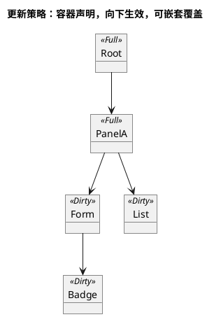

# 004-更新策略与状态保持

## 1. 两种更新模式

| 模式 | 语义 | 适合场景 |
|---|---|---|
| 整体重建（Full Rebuild） | 子树完整重新生成，整棵子树重新布局与绘制 | 游戏 HUD、整体刷新、动画场景 |
| 局部 Dirty | 仅重算被标记变更的局部子树，未变更部分复用 | 表单输入、单元格修改这类高频局部改动 |

更新策略是**容器节点的子树配置**，向下作用后代。组件本身对更新策略完全无感知：同一组件代码无需任何修改即可运行在任意模式的子树下。



嵌套规则：父容器声明 A 模式，子容器可重新声明 B 模式；子容器的声明覆盖父级向下传递的默认。也可用策略容器把单个组件包裹，实现单组件特殊更新策略。

## 2. 更新管线

```
宿主调用 build(snapshot)
  → 基座重建受影响子树，生成新的 UiNode 子树
  → diff：按 key 匹配新旧节点（见 005）
  → 判定子树更新模式：
      Full  → 整棵子树进入重布局
      Dirty → 对比新树与上帧树，标记变更节点及其祖先为脏
  → 对脏子树执行布局
  → 生成 DrawCommand 与命中区域（脏区域）
  → 输出 UiFrame
```

- 在 Full 子树下，"重建 + 全量重布局"即完整结果，diff 退化为按 key 直接映射。
- 在 Dirty 子树下，只有被标记的节点重算布局，其余沿用上帧布局结果。
- **纯视觉脏**（Teleport 跟随偏移场景）：仅修改 portal 视觉偏移字段（如鼠标跟随 Tooltip 逐帧刷新）时，只标记该 Teleport 子树为视觉脏——**只重生成该子树绘制命令与命中区域，不重布局**，页面其余内容复用旧帧；仅当 portal 内部结构/尺寸变更时才自动触发完整布局重算（见 [008-交互焦点与宿主接口](008-交互焦点与宿主接口.md) 2.10）。

## 3. 视图状态仓库

可变视图状态（焦点、光标、滚动位置、选中/展开、弹窗开关）存在独立的**视图状态仓库**，**以 `semantic_key`（跨帧稳定的 key）索引**，与树分离。`node_id` 仅本帧有效，禁止用于持久存储（见 [003-场景树与节点模型](003-场景树与节点模型.md) 4）。

> **与业务表单状态严格隔离**：视图临时状态（焦点/光标/滚动/弹窗）归本仓库；业务表单状态（输入值、勾选、下拉选中）全部存宿主，靠 `BindId` 映射，**绝不进入本仓库**（见 [012-业务数据绑定](012-业务数据绑定.md)）。

> **焦点身份默认归 core**：组件和页面只声明“可聚焦”及业务数据，不传递、缓存或读写 `focus_key`。`UiTree` 按默认身份策略生成稳定 `semantic_key`，`ViewStateStore` 保存当前焦点并在重建后重映射。动态集合组件可以只声明 `auto-stable-identity`，由 core 按稳定结构特征分配内部身份；只有虚拟列表等离屏 item，或 core 无法可靠推导同一业务实体跨结构变化后身份的特殊场景，业务才复用已有实体 ID 提供 `semantic-id`。

```
ViewStateStore
 ├─ focus      当前焦点 semantic_key + 本帧 node_id / 焦点模型状态
 ├─ cursor     文本光标位置
 ├─ scroll     各滚动容器 scroll offset
 ├─ selection  选中 / 展开状态
 └─ modal      模态栈（见 008）
```

- 状态随 key 匹配在帧间**复用**（节点身份不变则状态保留）。
- 节点消失时状态进入回收待定（见 005 的延迟回收）。
- 业务数据不进入仓库；仓库内没有任何业务语义。

## 4. 组件无感知设计

- 组件只负责：给定 props/数据，产出 `UiNode` 子树。
- 组件**不读写**更新模式与身份策略；两者由祖先容器的配置决定。
- 组件若要跨帧保留状态（如输入框光标），只使用基座提供的**视图状态钩子**（按 `semantic_key` 自动映射到 `ViewStateStore`），不感知底层用的是 Full 还是 Dirty。
- 普通组件不接收或暴露 `focus_key`；焦点请求使用节点当前帧交互语义，焦点保持由 core 的稳定身份和 `ViewStateStore` 完成。

这样保证"同一组件代码可运行在任意模式子树下"（PRD 五-1 的同组件复用约束）。

## 5. 禁止运行时频繁切换

- 更新模式是**声明期静态配置**：在容器节点上声明，不随业务数据频繁翻转。
- 运行时不得在 Full / Dirty 之间高频动态切换；切换只允许发生在结构稳定的重构点。
- 违规场景由开发期检查提示（例如同一容器在连续帧间策略翻转即告警）。

## 6. 与 key 的关系

diff 匹配依赖 key（见 [005-key身份策略](005-key身份策略.md)）。视图状态仓库按匹配结果决定保留或回收，因此更新策略、身份策略与状态仓库三者必须协同：

- 同一 key 在新旧树中匹配 → 状态复用；
- 新 key 出现 → 分配新状态槽；
- key 消失 → 状态延迟回收。

## 7. 布局缓存（性能优化）

布局缓存分两层：叶子测量缓存和 Dirty 子树盒缓存。它们都是输入→输出的查表加速，不引入业务状态：相同输入永远得到相同 Layout，离线测试清空缓存不影响结果，`resolve` 纯函数性质不变。两个层级都必须服从 [006-布局引擎](006-布局引擎.md) 的单次测量不变量，不能为命中判断先递归测量子树。

### 7.1 叶子测量缓存（已落地）

- `DefaultLayoutEngine` 缓存原语的 `Constraints -> { width, height, baseline }`；文本、图片和几何叶子不会因为同一约束重复调用度量。
- 叶子缓存只在节点已经收到最终约束后查询，不能改变 Row/Column/Stack 对 child 的调度顺序。
- 适用：海量重复卡片、静态面板、文本/图片重复测量。

### 7.2 Dirty 子树 LayoutBox 缓存（已落地）

- `LayoutCache` 以 core 生成的 key 记录子树指纹、父约束、Full 覆盖标记和完整 `LayoutBox`。在 `UpdateMode::Dirty` 下，四者相同才直接复用整棵盒树。
- 容器不预先递归询问缓存。它先计算一个 child 的最终约束，再通过同一 `ChildMeasurer` 入口请求 child；入口命中则返回盒，未命中才测量。因此 Full/Dirty 共用布局调度，且一棵未命中的子树中每个源节点最多测一次。
- `Expanded` 与 `Overlay` 虽由父原语分阶段调度，内部 child 的缓存 key 仍保留完整的“父 / 包装器 / child”结构路径；不能把它们折叠为父容器的第 0 个 child，否则会与普通 sibling 冲突。
- 节点 kind、layout、可影响尺寸的 content、子树结构或父约束变化都会失效；子树内有 `UpdateMode::Full` 覆盖时不复用其祖先 Dirty 盒。

### 7.3 未来 LayoutBoundary

- 如需显式重绘边界，可在 v1.1 引入 `LayoutBoundary`，但它必须包装现有 Dirty 缓存而不是另起一套测量过程。
- 边界语义、虚拟列表变高 item 尺寸池和并行调度都属于后续设计，不能削弱最终约束后一次测量的约束。

### 7.4 虚拟列表 item 尺寸缓存

- 定高 item：无需缓存，固定尺寸硬编码（见 [006-布局引擎](006-布局引擎.md) 6）；
- 变高 item（v1.1 与变高列表一并落地）：独立 **item 尺寸缓存池**，以 `semantic-id` 为 key 存储测量高度，滚动复用免重测；缓存仅列表容器私有，不污染全局布局管线。

## 8. 规则

- 🔧 更新策略只在容器节点声明，向下生效，子容器可覆盖。
- 🔧 组件不得读写更新模式与身份策略，状态保持只用视图状态钩子。
- 🔧 视图状态仓库与业务数据隔离，仓库内无业务语义。
- 🔧 禁止运行时频繁动态切换更新模式。
- ✅ 布局缓存是纯函数加速：失效完全基于 UiNode 输入（layout/content/父 Constraints/子树结构），不引入运行时可变状态；离线测试清缓存不影响结果。
