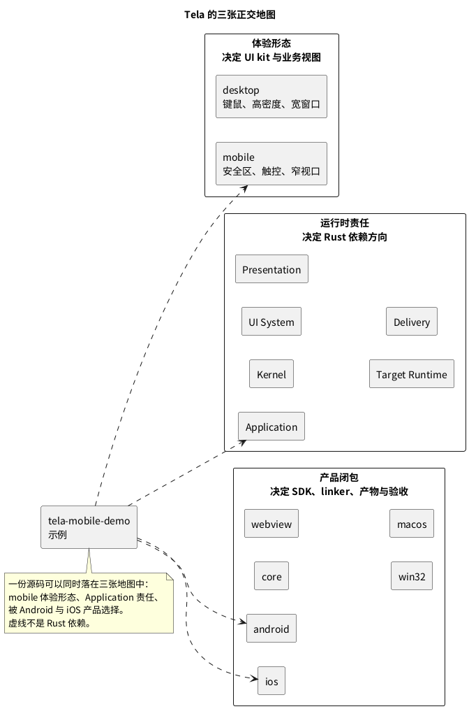
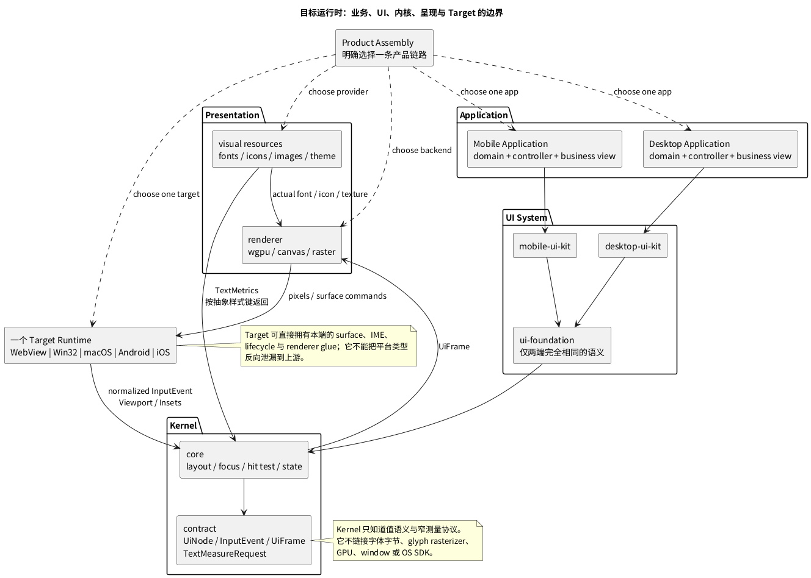
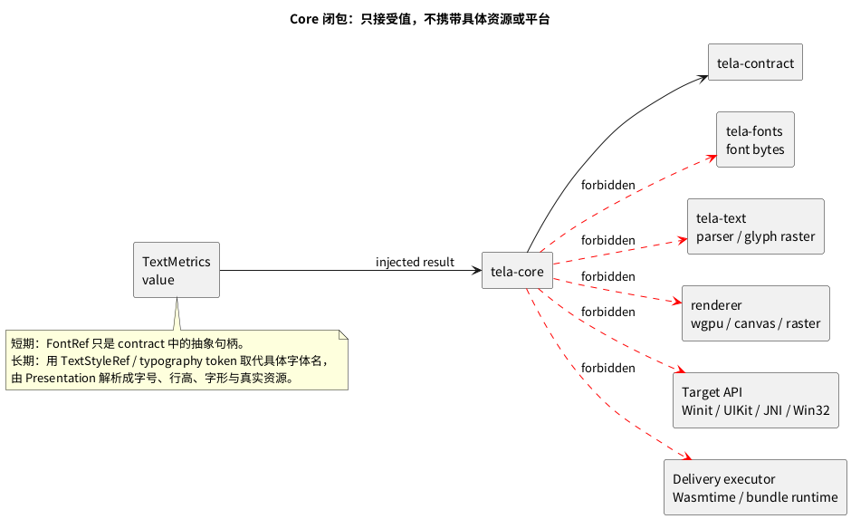
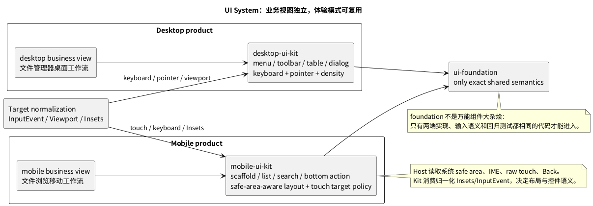
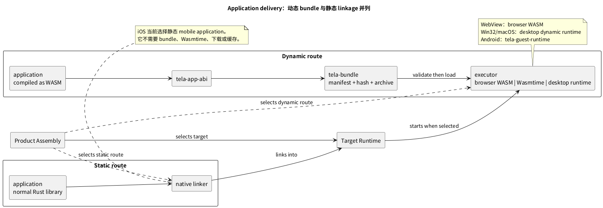
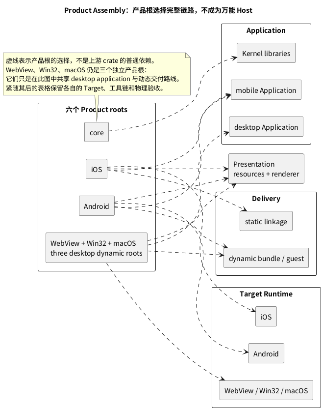
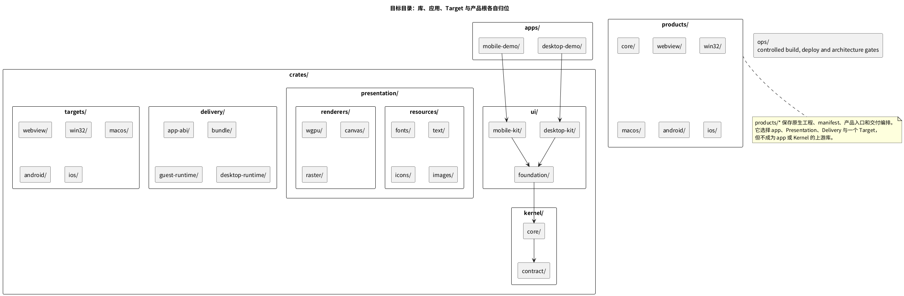
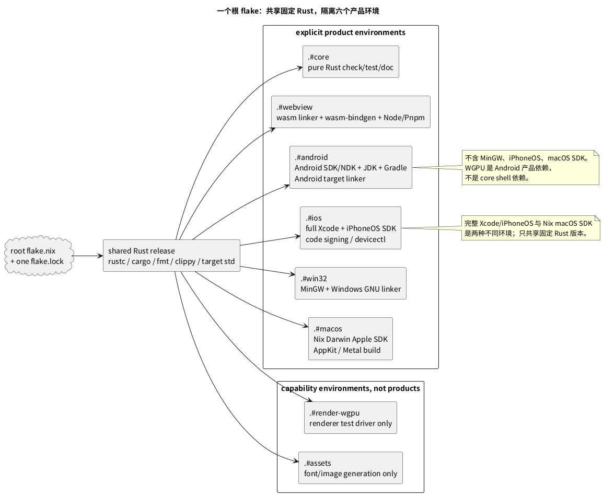
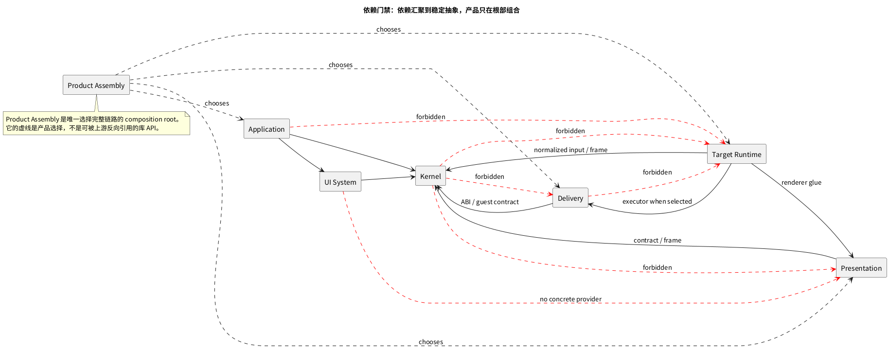
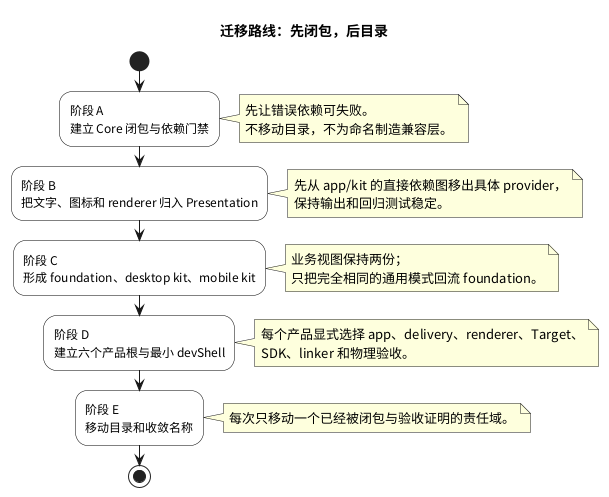

# 026-架构迭代方案：五端产品闭包与代码组织

> **状态：🟡 架构整理前的目标设计，尚未开始目录或依赖迁移。** 本文以当前已经落地的
> Win32、macOS、WebView、Android 和 iOS 为事实基线，重新定义后续代码整理的逻辑。
> “现状”只描述源码、构建配置和已完成的平台验收；“目标”是后续改造的约束，不能倒写为既有实现。
>
> 当前已覆盖两种体验形态：Win32、macOS 与当前 WebView 是 desktop；Android 与 iOS 是 mobile。
> iOS 已完成 iPhone 真机构建、签名、安装和图形验收，但这不意味着 Android/iOS、desktop/mobile
> 或动态/静态交付已经被抽象为同一套运行时。

## 总览：先看目标产品模型

后续代码组织不从当前目录反推，而从这个目标组合出发：

```text
产品 = 体验形态 × Application × UI System × Kernel
     × Presentation × Delivery Route × Target Runtime × Toolchain Profile
```



图的阅读顺序是从左到右，不是从上到下：`desktop/mobile` 是用户体验形态，五端是 Target，
动态/静态是 Delivery Route，六类构建是产品闭包。它们不应互相取代，也不应被硬塞进同一层目录。

## 1. 这次重整先打散旧分类，而不是继续给它加层级

原有 World Map 的一级方向有价值：Kernel、UI、Presentation、Target、Application、Delivery 都是
真实问题域。但原表的“二级域”混入了几种不能并列的分类方法，因而不能直接推导目录或依赖规则。

| 原来的条目 | 它实际回答的问题 | 不应与谁并列 |
|---|---|---|
| Contract / Engine | 内核内部的包与算法分工 | Renderer、Target 这类运行时责任域 |
| Primitive / Atomic / Molecular | 一个组件的组合粒度 | Application 的业务边界、平台 Host |
| Business | 某个产品的领域、控制器和业务视图 | 通用 UI kit 的组成层级 |
| Renderer / Visual Provider | 像素执行与视觉资源实现 | 组件粒度或应用层 |
| Target Host | 操作系统循环、表面和原生输入 | 平台无关组件库 |
| Capability Lock | 构建/治理机制 | 一帧 UI 的运行时层次 |

因此，本文不再试图为所有概念找到同一棵“三层目录树”。后续每个模块需要同时在三张彼此正交的
地图中定位：

1. **体验形态地图**：它服务 desktop、mobile，还是两者都完全相同？这决定 UI kit 和业务视图，
   不决定操作系统实现。
2. **运行时责任地图**：它是内核、UI 组合、视觉呈现、目标端、交付，还是最终装配？这决定 Rust
   依赖方向。
3. **产品闭包地图**：它属于 core、WebView、Android、iOS、Win32 还是 macOS 产物？这决定 Nix
   开发环境、链接器、SDK、产物与物理验收。

一个源码包可以在第一张地图中标记为 `mobile`，在第二张地图中属于 Application，在第三张地图中由
iOS 和 Android 两个产品选择。反过来，`iOS` 不是 UI kit 的分类，`.tela` 不是业务组件的分类，
`wgpu` 也不是 Kernel 的实现细节。

## 2. 先给六个问题各自的归属

以下是后续评审应先问的问题，而不是先讨论 crate 名称：

| 问题 | 正确归属 | 结论 |
|---|---|---|
| 这个页面该是密集键鼠工作流，还是安全区内的大触点工作流？ | 体验形态与 UI kit | desktop / mobile；不是 Win32 / iOS |
| 一个文件管理器的领域状态、命令和页面是什么？ | Application | desktop 与 mobile 业务视图独立；只在确实相同的领域逻辑处复用 |
| 节点、布局、焦点、命中和输入动作如何计算？ | Kernel | 纯 Rust、平台无关；不认识 GPU、窗口、字体文件或 OS API |
| 字体、图标、图片和 `UiFrame` 如何变成像素？ | Presentation | 字体字节、字形、纹理和 WGPU/Canvas/Raster 都在这里 |
| UIKit、GameActivity、AppKit、Win32、DOM 如何给出表面、IME、坐标与生命周期？ | Target Runtime | 五端各自实现；不能为统一目录伪造万能 Host |
| 应用代码是静态链接、浏览器 WebAssembly，还是经过 `.tela` 下载和校验？ | Delivery + Product Assembly | 交付方式是产品选择，不能由“移动端/桌面端”推导 |
| 哪个 SDK、链接器和工具链可参与一次构建？ | Product Toolchain | 六个产品闭包分别声明；共享固定 Rust 版本，不共享无关工具 |

这也给出本文最重要的判据：**desktop/mobile 是用户体验形态；五端是 Target；动态/静态是交付
方式；六类构建是产品闭包。它们不是同一层级的替代命名。**

## 3. 当前事实基线与需要纠正的地方

本节只记录迁移时不能忽略的既有闭包、原生工程和已完成验收，**不以当前 crate 名称或临时依赖反推
目标架构**。目标模型以前文三张地图和后文的依赖规则为准；现状只决定拆分次序、兼容期和验收负担。

### 3.1 已经成立的五端与两类应用

| 产品 | 当前体验形态 | 应用选择 | 交付方式 | 当前 Target Runtime / 原生工程 |
|---|---|---|---|---|
| core | 无终端 | `tela-contract`、`tela-core` 等 Rust 库 | Rust library，不是可运行 App | 无 |
| WebView | desktop | `tela-demo` | `.tela` 中的 WASM，由浏览器侧加载 | `tela-webview-sdk` + `web/` |
| Win32 | desktop | `tela-demo` | desktop `.tela` bundle | `tela-win32-sdk` |
| macOS | desktop | `tela-demo` | desktop `.tela` bundle | `tela-macos-sdk` + App bundle |
| Android | mobile | `tela-mobile-demo` | mobile `.tela` bundle + Wasmtime guest | `tela-android-sdk` + `android/` GameActivity |
| iOS | mobile | `tela-mobile-demo` | Rust 静态链接，不使用 WASM / bundle | `tela-ios-sdk` + `ios/` Xcode UIKit/Metal 工程 |

这里的 `core` 是第六类**产品构建闭包**，不是第六个操作系统 Target。所谓“内核打包”指纯 Rust
库的编译、测试、文档和将来的发布闭包；它不应被包装成一个虚假的跨平台可执行文件，也不能带入
renderer、字体实现、窗口系统或任何原生 SDK。

动态交付已经有三种不同执行位置：WebView 使用浏览器 WebAssembly，Win32/macOS 使用 desktop
runtime，Android 使用无窗口的 `tela-guest-runtime`。它们可以共享 ABI、bundle 格式或校验规则，
却不因此共享 GUI 生命周期。iOS 的静态移动应用是第四种有效选择，证明 `.tela` 不是 Tela 的唯一
应用模型。

### 3.2 当前依赖图的真实边界

| 当前对象 | 已验证事实 | 对目标整理的含义 |
|---|---|---|
| `tela-contract` | 零依赖；定义 `UiNode`、`UiFrame`、输入、资源句柄和 `TextMeasurer` 契约 | 可作为纯内核契约起点；资源句柄不是资源实现 |
| `tela-core` | 正常依赖只指向 `tela-contract`；但测试 dev-dependency 仍指向 `tela-render-raster` | 生产闭包已接近纯内核；测试闭包还没有完全隔离 renderer |
| `tela-fonts`、`tela-text` | 前者内嵌字体字节，后者使用 `ab_glyph` 做受控度量和字形定位 | 属于视觉资源/文字实现，不属于 Kernel |
| `tela-icon` | 同时拥有 `IconName` 语义和 Material 字体/度量实现 | 当前语义与 provider 混在同一 crate，是后续拆分点 |
| `tela-widgets`、`tela-ui` | 前者含 Button/Input 等控件，后者含 Form/Table/Toolbar 等组合；两者都直接依赖 `tela-fonts`，后者还依赖 icon/text 实现 | 尚不是无资源依赖的 UI foundation；`tela-ui` 的现有形状更接近 desktop kit 种子 |
| `tela-demo`、`tela-mobile-demo` | 已是两套独立 domain、application 和 presentation；mobile demo 没有依赖 `tela-ui`/`tela-widgets` | 不复用业务视图；mobile kit 需要从稳定的移动通用部分提取，不能把 mobile app 改名为 kit |
| `tela-render-*` | 只消费 contract / `UiFrame`，其中 WGPU 与 Raster 使用文本实现 | 是 Presentation 的 renderer，不得反向依赖 app、UI kit 或 Target |
| `tela-app-abi`、`tela-bundle`、`tela-guest-runtime`、`tela-native-sdk-runtime` | 已形成动态交付、严格校验、guest 执行与 desktop 缓存/生命周期的链条 | 属于 Delivery，不是所有 Target 的通用 native runtime |
| `tela-*-sdk` | WebView、Win32、macOS、Android 已组合不同的原生 API、renderer 与动态交付；iOS 还直接静态链接 mobile app | 当前命名中的 “SDK” 多数是 Target Runtime 或产品装配，不应误判为纯 Host 库 |
| 根 `flake.nix` | 现在有默认 shell，Linux 默认 shell 还带 MinGW、Mesa/Vulkan 等；另有 Android / iOS 特化 shell | 已具备局部隔离基础，但尚未形成六个显式、最小的产品 shell |

尤其要避免把“`tela-core` 不依赖 `tela-fonts`”误写成“内核已经完全不感知字体”。当前 contract 中
仍有 `FontRef`，应用与 UI crate 还直接使用 `tela-fonts` 和 `ControlledTextMeasurer`。短期底线是
Kernel 的依赖闭包不含字体字节、字体解析或 rasterizer；长期目标是把 core-facing 的具体字体名称
收敛为不透明的 `TextStyleRef` / typography token，由 Presentation 解析为字体、字号、行高与字形。
Kernel 只持有可缓存的样式键、测量请求和返回的 `TextMetrics`。

## 4. 新的运行时责任地图

运行时只保留六个稳定责任域。它们不是“从上到下的一条调用链”，而是在同一个产品中以受限方向
合作；其中 Product Assembly 在运行时以外完成选择与连接。



### 4.1 Kernel：可移植 UI 语义与算法

Kernel 由 `contract` 和 `core` 两个内部责任组成，不再把它们同 Renderer、Host 并列为全局二级域。

- **contract**：值语义的 UI 语言。节点、布局约束、输入/动作、帧命令、资源的抽象引用，以及窄的
  `TextMeasurer` 请求/响应协议都在此处。
- **core**：树校验、解析、布局、dirty cache、命中、焦点、交互和 `DefaultApplicationProfile` 等纯算法。
  它可以向外请求文本度量，但不打开字体、纹理或窗口。

Kernel 的硬边界如下：

1. 正常、build 和最终纯内核测试闭包都不得引入 `wgpu`、Winit、`windows`、`objc2`、JNI、DOM/wasm
   binding、Android/iPhone SDK、bundle executor、字体字节、字体解析器或字形 rasterizer。
2. `UiFrame` 可以传递抽象视觉语义，但 Kernel 不选择 GPU API、字体 provider、图标字体、图片解码器
   或平台 fallback。
3. `TextMeasurer` 是为布局提供值的窄协议，不是万能资源 Host。将来它的 key 应从具体 `FontRef` 过渡
   到不透明 text-style token；这不要求提前创造全局 provider trait。
4. `tela-core` 现有 Raster dev-dependency 必须在内核隔离阶段迁至独立测试/快照 harness，避免“生产
   无 renderer，测试却必须编译 renderer”的假纯净。



### 4.2 UI System：foundation、desktop kit、mobile kit

UI System 是**体验形态**的边界，而不是 OS SDK 的边界。它只依赖 Kernel，产出平台无关的 UI 语义；
它绝不直接读取 UIKit safe area、Android `MotionEvent`、Windows 消息、DOM、GPU surface 或字体字节。



| 子域 | 责任 | 不应拥有 |
|---|---|---|
| `ui-foundation` | 两端完全一致的语义原语、可访问交互意图、间距/颜色/文字/图标的抽象 token，以及确实相同的低层受控控件 | 平台样式分支、Material 字体实现、业务页面、桌面或移动专属导航 |
| `desktop-ui-kit` | 键鼠优先、信息密度、菜单/工具栏/表格/多窗格、快捷键焦点和 desktop 版对话交互 | Win32/AppKit API、mobile safe-area 查询、mobile 业务视图 |
| `mobile-ui-kit` | 安全区内的页面 scaffold、单列信息层次、44pt/48dp 可触达控件策略、触控友好的列表/搜索/底部动作和移动导航语义 | UIKit/Android 触控转换、IME 实现、手势识别器、desktop 业务视图 |

`Primitive → Atomic → Molecular` 只保留为 kit **内部**的组件组合术语，不再承担目录层级：同一个
desktop kit 或 mobile kit 内可按 primitive、control、pattern 组织测试和模块，但是否独立 crate 只由
稳定性、编译闭包和复用证据决定。`Business` 从此不再是 UI kit 的最上层，它属于 Application。

mobile kit 中的 safe-area 规则也要分清两半：Target Runtime 从系统取得并归一化 `Insets`，mobile kit
使用传入的 `Insets` 决定 scaffold 和固定栏的布局。前者不能进入 kit，后者不能留在 UIKit/Android
业务代码。类似地，Host 负责把 raw touch、Back、键盘和 IME 转为 `InputEvent`；kit 只定义控件的
语义状态、命中目标和动作。当前 iOS 的 12pt touch slop、whole-value IME 和 safe-area adapter，以及
Android 的触控/IME/Back，继续留在各自 Target Runtime。

触点大小、安全区、焦点顺序、禁用状态和可见反馈是 mobile kit 的体验契约；具体原生 accessibility
tree、手势竞争裁决和系统键盘桥接仍是 Target 的工作。desktop kit 则以键盘、指针和高密度工作流为
第一约束，不能为了“跨端”退化为手机页面的放大版。

### 4.3 Application：领域、控制器与业务视图

Application 拥有产品的领域模型、命令、session/controller、路由和业务视图组合。它选择 desktop 或
mobile kit，但不依赖某一个 Target Runtime。

- `tela-demo` 是 desktop application；`tela-mobile-demo` 是 mobile application。它们继续是两份
  独立业务视图和独立 mock domain，不把 macOS/Win32 的桌面视图拿去给 iOS/Android 使用。
- 两个应用仅在**绝对一致**的领域值对象、协议或算法上共享 Rust 库。相近的页面结构、名称或产品
  目的不足以证明业务视图可以复用。
- 当 mobile demo 中出现与领域无关、可由第二个 mobile 页面或产品验证的 scaffold、行、搜索、sheet
  或导航模式时，才迁入 `mobile-ui-kit`。预览页、文件条目领域、mock repository 和命令语义仍留在 app。
- 当 desktop demo 中的 Table、Toolbar、Form、Dialog 等模式与领域剥离后，迁入 `desktop-ui-kit`；不要
  把 `tela-ui` 的当前所有代码机械改名为 kit。

应用不应自行选择 `ControlledTextMeasurer`、嵌入字体字节或 Material glyph。产品装配在应用会话和
Presentation 之间接入具体视觉实现；在过渡期，先将这些依赖逐步从 kit 与 app 的直接依赖图移出，
再调整 API，不制造兼容层叠加。

### 4.4 Presentation：视觉资源与 renderer

Presentation 有两个相邻但不同的子域：

- **visual resources**：字体资源、字体解析/度量、字形 raster、图标 provider、图片/纹理解码、主题
  到实际视觉参数的映射。当前 `tela-fonts`、`tela-text` 以及 `tela-icon` 中的 Material 实现应归入此处。
- **renderer**：把 `UiFrame` 与已选择的视觉资源变成像素。当前 WGPU、Canvas、Raster 分别是 renderer。

Renderer 可以复用，前提是同一份代码真的能在多个 Target 中工作；Renderer 可复用不推出窗口循环、
输入、IME、surface lost 处理或 lifecycle 可复用。资源 provider 也不应被冒充成 Kernel：它可以实现
`TextMeasurer` 并向 Kernel 返回数据，却不能反向把字体、图标或 GPU 依赖带进 Kernel。

### 4.5 Target Runtime：五个不可伪统一的原生边界

Target Runtime 是每个端的窗口/视图、表面、坐标、输入、IME、生命周期和目标专属资源接入处：

| Target | 留在本端的责任 | 不能向上泄漏 |
|---|---|---|
| WebView | DOM、rAF、浏览器 WebAssembly、浏览器 IME、Canvas/WebGPU 表面 | DOM 类型、JS 生命周期和浏览器缓存策略 |
| Win32 | Win32 消息、窗口、DPI、surface、键鼠、WGPU/网络启动细节 | `windows` crate、Win32 句柄、平台消息 |
| macOS | AppKit、Metal、窗口/输入、应用生命周期和 desktop bundle 启动 | objc2/AppKit/Metal 类型、macOS bundle 细节 |
| Android | GameActivity、JNI、Vulkan/WGPU、touch、原生 IME、Back、远程 mobile bundle 启动 | Android API、JNI、Activity 生命周期、NDK 环境 |
| iOS | UIKit/Winit、Metal/WGPU、safe area、touch、whole-value IME、foreground/background surface 恢复 | UIKit、Objective-C helper、Xcode 签名、iPhoneOS SDK |

不创建跨端 `Host` trait、`ShellDriver` 或 Android/iOS 共用 `mobile runtime`。Target Runtime 可以在本端
直接依赖一个 renderer 或 delivery executor；只要它不把平台类型反向带进 Kernel/UI/Application，就没有
必要为“更纯”的目录而拆出一层动态分发。当前 `tela-*-sdk` 多数正是这类 target-specific runtime 的
第一份实现。

### 4.6 Delivery：应用代码到运行时的路线

Delivery 与 Target 正交。它定义应用代码如何到达已启动的 Target Runtime，而不拥有窗口或业务页面：



| 路线 | 当前实现 | 适用产品 |
|---|---|---|
| 动态 ABI / archive | `tela-app-abi`、`tela-bundle`、签名/哈希校验 | WebView、Win32、macOS、Android |
| 原生 guest 执行 | `tela-guest-runtime` / desktop 的 `tela-native-sdk-runtime` | Android、Win32、macOS；浏览器有自己的 WebAssembly 执行环境 |
| 静态 Rust linkage | app crate 与最终 Target 直接链接 | iOS 当前 mobile product |

Delivery 只能依赖 ABI、bundle、验证、缓存和执行所需的中性代码；`tela-guest-runtime` 已有的“不得依赖
任一 Target SDK”规则继续成立。iOS 不能因为其他产品用了 bundle 就被拉入 Wasmtime、下载、缓存或
动态 ABI 闭包；Android 也不能因为 iOS 是静态链接而改为把 mobile app 静态编进 GameActivity。

## 5. Product Assembly：六个显式构建闭包

Product Assembly 是唯一允许把 Application、Delivery、Presentation 和一个 Target Runtime 组合在一起
的地方。它不是运行时万能接口，而是一个明确的产物根：只选择已批准的一条链路，生成一类可验证产物。



| 产品闭包 | 选择的运行时链路 | 产物与验收 | 必须隔离的工具/SDK |
|---|---|---|---|
| `core` | `contract + core`，以及已满足纯净规则的 `ui-foundation` | Rust library 的 check/test/doc/package 闭包；不启动 UI | 固定 Rust；无 GPU runtime、无字体资产工具、无平台 SDK |
| `webview` | desktop app + dynamic bundle + WebView runtime + Web renderer | browser host、WASM、静态 Web 资产和 bundle 校验 | wasm target/linker、wasm-bindgen、Node/pnpm；不带 Android/Win32/iOS SDK |
| `android` | mobile app + dynamic mobile bundle + guest runtime + Android runtime + WGPU | `arm64-v8a` APK、真机 IME/touch/Back/Vulkan 验收 | Android SDK/NDK、JDK、Gradle、Android Rust target；不带 MinGW/Xcode |
| `ios` | static mobile app + iOS runtime + Metal/WGPU | `aarch64-apple-ios` Xcode App、签名和 iPhone 真机验收 | 完整 Xcode/iPhoneOS SDK、iOS Rust target；不带 Android SDK/MinGW |
| `win32` | desktop app + desktop dynamic bundle + Win32 runtime + WGPU | `x86_64-pc-windows-gnu` 壳和 Windows 验收 | MinGW/Windows linker；不带 Android/iOS SDK |
| `macos` | desktop app + desktop dynamic bundle + AppKit/Metal runtime | Apple Silicon `Tela.app` 和 macOS 图形验收 | macOS Apple SDK/Nix Darwin 环境；不带 iPhoneOS/Android/MinGW |

产品闭包中的 renderer、字体和资源当然会随所选应用进入最终产物；这不违反“内核不感知它们”。隔离的
判据是它们只能从 `presentation` / `product` 向下游出现，不能逆向成为 `kernel`、`ui-foundation` 或另一
个产品 shell 的普通依赖。

当前 iOS 的 `tela-ios-sdk -> tela-mobile-demo` 直接依赖是一个**产品装配事实**，不是可复用 Host 的证据。
后续若需要让一个 iOS host 支持第二个静态 app，再把其中真正不认识业务的 UIKit/Metal 代码抽到
`targets/ios`；在此之前，先把它归类为 iOS product runtime，避免为了目录美观制造抽象。

## 6. 目标目录：目录由责任与产品根自然推出

下图是目标物理投影。它不是要求一次性搬迁的文件操作，也不要求每个目录立即对应一个公开 crate；
它规定了稳定后新代码应落在哪里，以及旧 crate 到期后应向哪里迁移。



目录层级不应被误解为依赖层级：`products/ios` 可以选择 `apps/mobile-demo`、`delivery` 的静态路线、
`presentation/renderers/wgpu` 和 `targets/ios`；`apps/mobile-demo` 却不能反向依赖 `products/ios`。
同理，`targets/android` 可以使用 Android 专属 WGPU surface，但 `kernel/core` 永远不能引用它。

### 6.1 当前对象到目标位置的迁移台账

| 当前对象 | 目标责任/位置 | 迁移前置条件 |
|---|---|---|
| `tela-contract` | `crates/kernel/contract` | 保持零实现依赖；逐步把具体字体名转为不透明样式引用 |
| `tela-core` | `crates/kernel/core` | 移走 Raster dev-dependency，保留只依赖 contract 的算法闭包 |
| `tela-widgets` | 先拆出 `ui/foundation` | 移除 `tela-fonts`；仅保留被两类 kit 原样使用的控件语义 |
| `tela-ui` | 优先成为 `ui/desktop-kit` 的候选来源 | 将 Table/Toolbar/Form 等从 desktop 领域代码中验证后迁入；不机械搬运 |
| `tela-mobile-demo` 的通用移动视图片段 | 新 `ui/mobile-kit` 的候选来源 | 只提取无领域状态的 scaffold/pattern；保留 mobile business view 与 mock domain |
| `tela-fonts`、`tela-text` | `presentation/resources/fonts`、`presentation/resources/text` | 从 app/UI kit 的直接依赖中移出；由产品选择 provider |
| `tela-icon` | `ui` 中的图标语义 + `presentation/resources/icons` 中的具体 provider | 先明确哪些 `IconName` 是产品语义，哪些 glyph/metrics 属于 Material 实现 |
| `tela-render-*` | `presentation/renderers/*` | 维持不依赖 app、kit、Target 的方向；按实际复用决定是否拆 provider |
| `tela-app-abi`、`tela-bundle`、`tela-guest-runtime`、`tela-native-sdk-runtime` | `delivery/*` | 保持 guest runtime 无 Target SDK；重新命名只在责任稳定后发生 |
| `tela-webview-sdk`、`tela-win32-sdk`、`tela-macos-sdk`、`tela-android-sdk`、`tela-ios-sdk` | `targets/*` 与相应 `products/*` | 先划清其中 host/runtime 与最终 app 装配；不以共享 trait 强行拆分 |
| `android/`、`ios/`、`web/` 与桌面打包资源 | `products/<target>/` | 在 Rust 包边界和构建命令稳定后再移动原生工程/静态资源 |

## 7. Nix 与工具链：一把锁，六个最小环境

本仓库不应为六个产品分别维护六份独立 `flake.lock`。那会让“统一 Rust 版本”退化成口头约定，也会让
Nixpkgs、Node、Android/Apple 工具链和构建脚本各自漂移。正确模型是：**一个根 `flake.nix`、一个锁文件、
六个显式 `devShells` / package outputs / check profiles。**



建议的 shell 矩阵如下；不支持的宿主平台必须明确拒绝，而非悄悄降级到默认 shell。

| shell | 可用宿主 | 共享内容 | 专属内容 | 绝不继承 |
|---|---|---|---|---|
| `.#core` | Linux、Apple Silicon macOS | 固定 Rust 编译器、Cargo、fmt、clippy，以及仅用于运行项目级 `ops` 的最小 Node | 纯 Rust check/test/doc | WGPU test driver、fonttools、Pnpm/wasm-bindgen、MinGW、Android、Xcode |
| `.#webview` | Linux、Apple Silicon macOS | 固定 Rust 基线 | wasm target/linker、wasm-bindgen、Node/Pnpm | Android/iOS/Win32 SDK |
| `.#android` | 当前为 WSL x86_64 Linux | 固定 Rust 基线；需要时 WASM delivery 工具 | Android SDK/NDK、JDK、Gradle、`aarch64-linux-android` linker | MinGW、iPhoneOS、macOS SDK、通用 GPU 测试驱动 |
| `.#ios` | Apple Silicon macOS | 固定 Rust 基线 | 完整 Xcode、iPhoneOS SDK、`aarch64-apple-ios` target、签名/`devicectl` wrapper | Android SDK、MinGW、Linux Vulkan 工具 |
| `.#win32` | 当前为 WSL x86_64 Linux 交叉构建 | 固定 Rust 基线；需要时 WASM delivery 工具 | MinGW、Windows GNU linker、Win32 target std | Android、iOS、macOS SDK |
| `.#macos` | Apple Silicon macOS | 固定 Rust 基线；需要时 WASM delivery 工具 | Nix Darwin Apple SDK/AppKit/Metal 构建环境 | Android、iPhoneOS、MinGW |

可另设 `.#render-wgpu` 与 `.#assets` 两个**能力 shell**，前者只放 Mesa/Vulkan/Metal 等 renderer 测试
环境，后者只放 fonttools 等资产生成工具。它们不是产品 shell，也不能被 `.#core` 默认继承。

固定版本的含义不是让每个 shell 带完全相同的工具，而是让所有产品使用同一条明确的 Rust release
和兼容的 target std：

1. 根 flake 必须有唯一的 Rust 版本来源，并向 Cargo、rustfmt、clippy、Android bootstrap 与 iOS
   bootstrap 传递同一版本；不能让某些路径无约束地跟随当日 `stable`。
2. 每个产品单独设置自己的 target linker、SDKROOT/DEVELOPER_DIR、`JAVA_HOME`、NDK 路径和
   `CARGO_TARGET_DIR`。这些变量不能放进根 shell 或其他产品的 shell hook。
3. workspace 可以共用 `Cargo.lock`、源码和受控 `ops` 命令；lockfile 中出现某个依赖不等于该依赖
   进入所有产品的编译/运行闭包。实际隔离由 package 依赖图、target cfg、feature、Nix shell 和产品
   entry root 共同证明。
4. 现在 Linux 默认 shell 带 MinGW 与 Mesa/Vulkan、Android/iOS 各有特化 shell 的布局是过渡状态。
   目录整理后，默认 shell 应收缩为 `.#core`，其他五类构建必须显式进入对应 shell。

完整 Xcode 与 Nix macOS SDK 仍是两个不同环境：macOS 产品可继续走 Nix Darwin Apple SDK；iOS 产品
必须经完整 Xcode 的 iPhoneOS SDK、签名和设备工具。两者共享 Rust 版本，不共享 SDK 环境。

## 8. 依赖规则与构建门禁

后续代码改造应先把规则落到 `ops` 架构检查和每个产品的最小构建入口，再移动目录。推荐的规则如下：

| 源域 | 允许依赖 | 禁止依赖 |
|---|---|---|
| Kernel | Rust std、Kernel contract/core 内部关系 | Presentation、Target、Delivery、Application、具体字体/GPU/平台库 |
| `ui-foundation` | Kernel | Presentation provider、Target、Delivery、Application、具体字体/图标实现 |
| desktop/mobile UI kit | Kernel、foundation、本 kit 内部模块 | 对方 kit、Target、renderer、具体资源 provider、业务 app |
| Application | Kernel、选择的 UI kit、明确共享的领域库 | Target、renderer、原生 SDK、另一类业务视图 |
| Presentation | Kernel contract 与同域资源/renderer | Application、UI kit、Target 的生命周期类型 |
| Delivery | ABI、bundle、验证、执行所需中性库 | Target SDK、renderer、业务 app；静态 linkage 是 Product 的选择 |
| Target Runtime | 本端原生 API、选择的 renderer/delivery 实现、稳定 contract | 业务 application；其他 Target 的 API 或工具链 |
| Product Assembly | 经过批准的一条 app + delivery + presentation + target 链 | 第二个 Target、未选择的 form factor、隐式 fallback |

这里有两项刻意保留的局部例外：第一，Target Runtime 内可以拥有本端的 WGPU surface 与 renderer glue，
因为这不是 Kernel 共享代码；第二，当前 iOS product runtime 静态链接 mobile app，因为它本来就是最终
产品根。例外必须在产品闭包中显式记录，不能变成上游 crate 的普通依赖。



每次迁移至少验证下面四类证据：

1. **Cargo 闭包**：分别检查 normal、build、dev dependency；`core` 的 `cargo tree` 不能因测试而带入
   renderer，kit 不能因默认 feature 带入字体或平台 crate。
2. **产品选择**：`cargo metadata` 与现有架构规则必须证明 Android 不引入 Win32，iOS 不引入 bundle /
   Wasmtime，desktop 不静态链接 mobile app。
3. **Nix 环境**：每个 `nix develop .#<product>` 只能发现本产品的 compiler、SDK、linker 和环境变量；
   `.#core` 不应能偶然通过某个 GPU 或 Android 依赖编译。
4. **目标验收**：WebView、Windows、macOS、Android 真机和 iPhone 真机分别保留自己的图形、输入、
   生命周期和交付验收。交叉编译、依赖图或 Nix evaluation 不能替代本端图形验收。

## 9. 迁移顺序：先让边界成立，再让路径变漂亮



### 阶段 A：建立可失败的核心闭包

1. 新增 core / kit / presentation / target / product 的依赖方向门禁，并让当前 package 图成为基线。
2. 将 `tela-core` 的 Raster 测试依赖移到独立 harness，使 core 的 normal、build、dev 闭包都不包含
   renderer。
3. 给每个现有 `tela-*-sdk` 标记当前是 Target Runtime、Delivery 组合还是 Product Assembly；先改
   责任说明与门禁，不急于重命名 crate。

### 阶段 B：把视觉实现从 UI 与应用中拔出

1. 将字体字节、受控字形度量、Material glyph 映射放入 Presentation 的资源子域。
2. 用语义 text/icon token 替代 app/kit 对 `tela-fonts`、具体 `FontRef` 名称和 glyph 字符串的直接依赖。
3. 由产品装配把选中的 `TextMeasurer`、图标/主题 provider 接入应用会话；先保持输出和回归测试稳定，
   再清理旧入口。

### 阶段 C：形成三层 UI System，但不搬业务视图

1. 从 `tela-widgets` 中抽出 desktop/mobile 真正完全相同的最小 foundation。
2. 将已验证的 Table、Toolbar、Form、Dialog 等 desktop 模式整理成 desktop kit。
3. 从 mobile app 中抽出无领域状态的 scaffold、mobile search/list/action/navigation 模式，形成 mobile kit。
4. desktop 和 mobile 业务应用继续独立。只有同一份实现、同一输入/动作语义和同一回归测试都成立时，
   才回流 foundation。

### 阶段 D：建立六个产品根与最小 shell

1. 为 core、WebView、Android、iOS、Win32、macOS 建立显式产品 entry root 与构建命令。
2. 将根 flake 变为一个锁文件下的六个最小 shell；把 renderer 测试和资产工具移出默认 shell。
3. 在每个产品根记录选择的 app、delivery、renderer、Target 与目标架构；不允许 `ops build` 通过默认
   环境猜测目的地。

### 阶段 E：最后才移动物理目录与名称

1. 每次只移动一个稳定责任域，同时更新 workspace member、Nix entry、ops 路径和架构门禁。
2. 先保留 package 名称或用兼容 re-export，待依赖图和产品产物稳定后再做命名收敛。
3. 不做“一次性把所有 crate 归类到新目录”的提交；目录本身不能证明边界，闭包和验收才能。

Capability Manifest / Lock、版本求解、自动 fallback、插件 ABI 和 TUI 仍然不是这轮整理的前置条件。
当六个产品闭包、UI kit 与资源边界已由真实构建证明后，若出现多应用、多能力选择的实际需求，再单独
决定是否需要 Lock；它不能抢在产品边界之前成为新的中心抽象。

## 10. 后续评审清单

任何新 crate、移动代码或目录调整都必须能回答：

1. 它在体验形态上属于 desktop、mobile，还是两端完全一致的 foundation？
2. 它在运行时责任上属于 Kernel、UI System、Application、Presentation、Target Runtime、Delivery 还是
   Product Assembly？
3. 它进入哪一个或哪几个产品闭包？有没有让 Android 看到 Win32、让 core 看到 GPU/字体、让 iOS 看到
   动态 guest？
4. 若要复用代码，是否真的没有目标条件分支、业务视图差异和不一致的输入/生命周期？若只有概念相同，
   为什么不是共享命名或协议而是共享 crate？
5. 若涉及文本、图标或图片，Kernel 得到的是不透明语义/测量值，还是已经泄漏了某个资源 provider？
6. 若涉及安全区、IME、touch、快捷键或 accessibility，哪一半属于 kit 的体验语义，哪一半必须留在
   Target 的原生适配？
7. 这次改变是否同时有 Cargo 闭包、Nix shell、产品构建和实际 Target 验收的证据？

只有这些答案一致时，新的目录结构才是架构的自然结果，而不是把当前混合依赖换一套路径继续存在。
