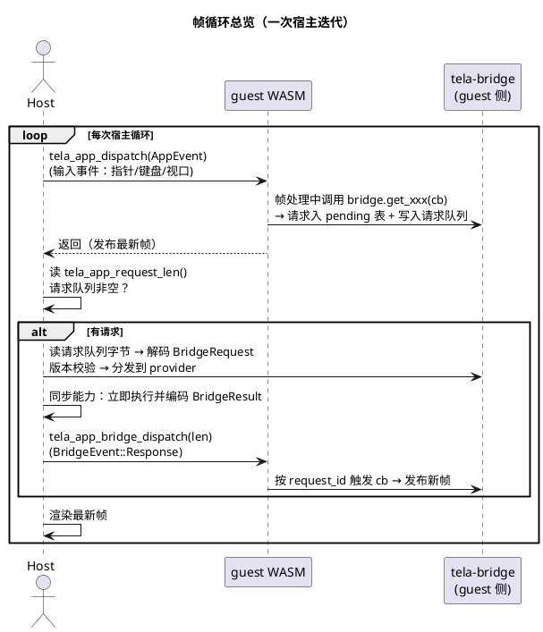
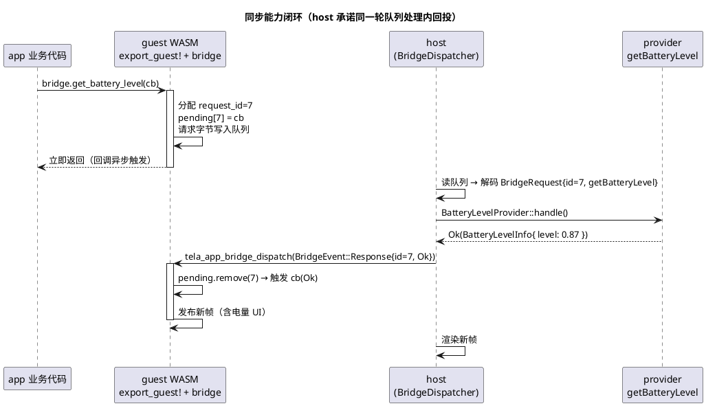
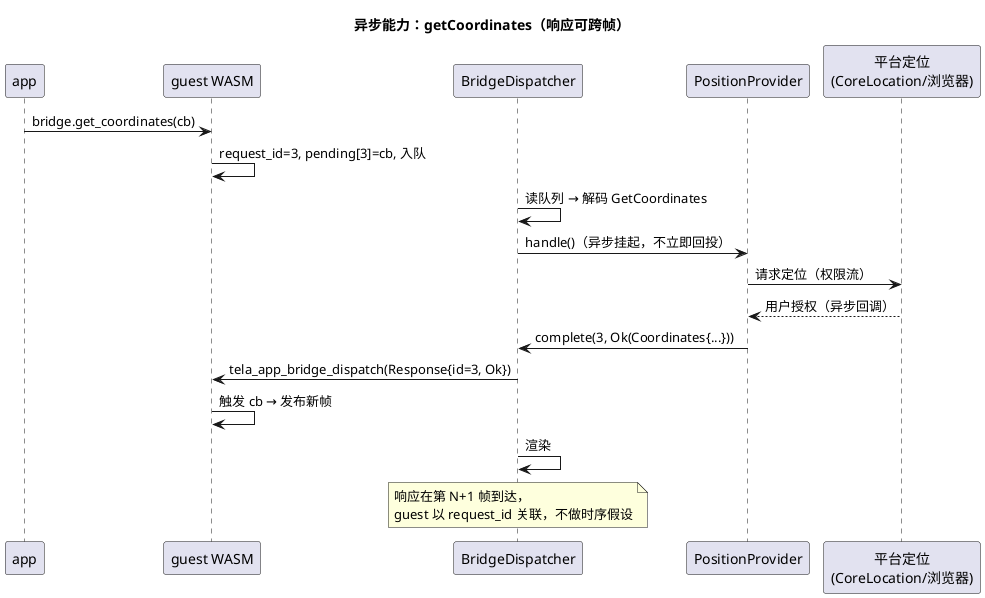

# 032-宿主桥 MVP 实施目标

> **状态：📋 实施目标（文档先行）。** 宿主桥的落地切片、架构决策、生命周期与验收门。设计语义见 [桥/000-宿主桥总览](桥/000-宿主桥总览.md) 与 [桥/通用模型](桥/通用模型/README.md)（16 只读桥：`base.canIUse`、device 12 桥、`position.getCoordinates`、`config.getConfig`）。本文回答：**桥在运行时怎么活**（生命周期）、**桥代码放哪**（crate 与导出集成）、**按什么顺序落地**（切片）、**怎么算完成**（验收门）。

## 1. 结论

宿主桥 MVP = 一个契约 crate（`tela-bridge`）+ 4 个桥 ABI 导出（guest 手写实现）+ 五端 provider 注册。guest 与 host 只在每次帧循环中交换**版本化字节包**，生命周期完全由现有帧循环驱动，不引入线程或异步 runtime。

- **契约层**：`crates/delivery/bridge/`（package `tela-bridge`），统一字节通道（`CapabilityId` + payload）+ postcard codec，零平台依赖，风格对齐 `tela-app-abi`。
- **统一外部契约**：std / 端侧 / 业务能力一律是"宿主提供的外部能力"，经同一注册表执行；guest 统一视为外部实现者（按 ABI 规范接入，零宏、无特权路径）。
- **传输层**：桥 ABI（4 导出）独立于 app ABI（`export_guest!` 不动）；`guest-runtime` 可选探测（无桥导出的 guest 桥透明不可用）。
- **实现层**：五端各注册 16 个 `std` provider（统一 `Provider` trait）+ `BridgeDispatcher` 注册表。
- **完成定义**：webview 闭环验收通过 + 四端薄封装实现 + `ops check` 四道门全绿。

## 2. 架构决策：统一外部契约 + 零宏

### 2.1 决策

**所有 guest 一律视为外部实现者**：桥 ABI 是公开规范（4 个导出 + `TLBR` 包格式），不依赖 `export_guest!` 宏、不依赖 tela-bridge 的代码生成。`export_guest!`（app-abi）保持原样，app-abi 不依赖 tela-bridge。

**所有能力一律视为外部契约项**：std 公开规范、端侧桥、业务桥经同一套发现（canIUse）/版本协商/请求通道访问，host 侧经同一注册表执行。

### 2.2 桥 ABI 导出规范（guest 手写实现）

| export | 方向 | 作用 |
|---|---|---|
| `tela_app_request_begin(len) -> ptr` | guest→host | 保留请求队列线性内存，guest 排队请求 |
| `tela_app_request_len() -> u32` | host 读 | 每次 dispatch 后读取排队请求长度 |
| `tela_app_bridge_dispatch_begin(len) -> ptr` | host 写 | 保留响应内存（host 写入 BridgeEvent 字节） |
| `tela_app_bridge_dispatch(len)` | host 调 | guest 解析响应并按 request_id 触发回调；当前 `void` ABI 不能请求 publication，状态变化等待下一次 app dispatch |

自有 Rust 源码的手写样板（转发到 `GuestBridge`）：

```rust
thread_local! { static BRIDGE: RefCell<GuestBridge> = ...; }
thread_local! { static BRIDGE_INPUT: RefCell<Vec<u8>> = ...; }

#[no_mangle] pub extern "C" fn tela_app_request_begin(len: u32) -> *mut u8 {
    // 保留 BRIDGE 请求队列内存，返回指针
}
#[no_mangle] pub extern "C" fn tela_app_request_len() -> u32 { /* BRIDGE.request_queue_len() */ }
#[no_mangle] pub extern "C" fn tela_app_bridge_dispatch_begin(len: u32) -> *mut u8 {
    // 保留 BRIDGE_INPUT 内存，返回指针
}
#[no_mangle] pub extern "C" fn tela_app_bridge_dispatch(len: u32) {
    // BRIDGE.handle_event_packet(&BRIDGE_INPUT[..len]) -> 回调更新状态
    // 当前桥 ABI 无 outcome；由下一次 app dispatch 请求 publication
}
```

**回调发布帧**：回调闭包由 guest 创建，天然可访问 app 状态并调用自己的帧发布逻辑——不需要宏注入，`GuestBridge` 不持有发布函数。

### 2.3 生命周期组件图

```plantuml
@startuml
title 统一外部契约：guest 与 host 只认 ABI 规范
skinparam componentStyle rectangle

package "guest（任何语言实现）" {
  [app 业务代码] as app
  [手写 4 个桥导出
(转发 GuestBridge)] as exports
  [GuestBridge 参考实现
(自有 Rust 源码用)] as gb
  app --> exports
  exports --> gb
}
package "host" {
  [BridgeDispatcher 注册表
std / 端侧 / 业务统一注册] as dispatcher
  [16 个 std provider] as providers
  [端侧 / 业务 provider
(Target / 宿主注入)] as named
}
exports ..> dispatcher : TLBR 包
gb ..> app : 回调更新状态
dispatcher --> providers
dispatcher --> named
@enduml
```

## 3. 传输层生命周期

### 3.1 帧循环总览（宏观）

宿主每帧做两件事：投递输入事件 + 处理桥请求队列。桥生命周期完全嵌套在既有帧循环内，无新线程、无异步 runtime：



### 3.2 单次请求闭环（同步能力，如 `getBatteryLevel` 本地读）



### 3.3 异步能力（`getCoordinates` 权限流跨帧）



### 3.4 iOS 静态路径

不走 wire：guest facade 直接调用注入的 provider trait（`BridgeDispatcher` 静态组合），时序语义一致（同步能力立即回投、`getCoordinates` 经平台回调完成）。生命周期图同 §3.2/§3.3，仅省去队列编解码。

## 4. 实施切片

### 切片 1：契约层 `crates/delivery/bridge/`（package `tela-bridge`）

- `version.rs`：`Version` / `VersionPolicy`（三策略匹配，含 `Range` 边界）
- `capability.rs`：`CapabilityId { group, name }`，Display = `std.<group>.<name>`，16 类型化常量
- `error.rs`：`BridgeError`（`UnknownCapability` / `VersionMismatch` / `PermissionDenied` / `Timeout`）
- `request.rs` / `result.rs`：统一字节信封 `BridgeRequest { request_id, version, capability, payload }` + `BridgeResult = Ok(Vec) | Err(BridgeError)`
- `payload.rs`：16 个 std 桥的载荷编解码辅助（`encode_get_config_request` / `decode_battery_level_response` 等）
- `event.rs`：`BridgeEvent::Response`（`Message` 预留不实现）
- `codec.rs`：`encode_request/decode_request/decode_request_stream/encode_event/decode_event`（postcard + magic `TLBR` + 自持 packet version）
- feature：`guest`（`GuestBridge` 统一能力 facade）、`host`（统一 `Provider` trait + 注册表 `BridgeDispatcher`）
- 单测：codec round-trip、载荷 round-trip、版本矩阵、CapabilityId Display、注册表分发、Pending/complete

**验证**：`cargo test -p tela-bridge`；`ops check`

### 切片 2：guest 导出与探测

- 契约层提供手写样板文档（§2.2）+ `GuestBridge` 库 API（队列/pending/facade/事件处理）
- demo guest 手写 4 个桥导出（转发 `GuestBridge`；thread_local 保留区），`export_guest!` 零改动
- `guest-runtime`：4 导出 optional 探测（`get_typed_func` 失败即降级，桥不可用不报错）；新增 `bridge_request_len()` / `bridge_deliver(bytes)` API（无桥恒 0/忽略）

**验证**：无桥 guest（未实现导出）构建通过且宿主不读队列；桥 guest 4 导出存在；`ops build bundle desktop`

### 切片 3：webview 首端闭环

- JS 侧手写 postcard 编解码器（桥包格式固定，~150 行）
- 16 provider（canIUse 静态表 + 浏览器探测；getCoordinates 走 geolocation 异步；getBatteryLevel/getBatteryCharging 走 Promise 异步）
- `BridgeDispatcher` 接入 webview 帧循环（§3.1）

**验证**：demo 页展示电量/网络/时间/版本；验收清单 §5 全项

### 切片 4：桌面端（macOS → win32）

- **共享驱动**（已完成）：`desktop-runtime::bridge`（process_bridge_requests/deliver_event）+ `bridge::common`（BuildConstants 版本五桥 + canIUse 静态表 + config）
- **win32**（已完成，WSL 交叉编译验证通过）：windows crate 直接调用（GetSystemPowerStatus / GetTimeZoneInformation+注册表 IANA id / InternetGetConnectedState / 共享窗口 metrics）；帧循环接入
- **macOS**（代码完成，编译验证待 Apple Silicon）：IOKit 电量 + SCNetworkReachability（手写 FFI）+ Foundation time（NSDate/NSTimeZone）+ 共享 view metrics；帧循环接入
- getCoordinates 桌面端**不注册**（CoreLocation/UWP Geolocator 权限流后置，canIUse 回 UnknownCapability）

### 切片 5：移动端（android → iOS）

- android：BatteryManager、ConnectivityManager、density、FusedLocationProvider
- iOS（静态路径）：UIDevice、NWPathMonitor、CoreLocation；不经 wire 直连 provider（§3.4）

### 切片 6：预留与收尾

- canIUse 静态表一致性检查（注册即实现；预留能力回 `UnknownCapability`）
- `reserved.md` 回归项核对（pubsub/Topic/Message 不注册）
- `ops check` 四道门全绿

## 5. 验收门

| # | 验收项 | 位置 |
|---|---|---|
| 1 | codec round-trip + `TLBR` 版本头校验 | 切片 1 单测 |
| 2 | `VersionPolicy` 三策略矩阵（Latest/Exact/Range 边界） | 切片 1 单测 |
| 3 | `CapabilityId` Display/常量；`Topic` 不注册 | 切片 1 单测 |
| 4 | 旧 guest（无桥导出）透明不可用 | 切片 2 |
| 5 | 同步能力同轮回投断言 | 切片 3（mock 无延迟 provider） |
| 6 | 异步能力跨帧可达、request_id 乱序安全（Pending + complete 路径） | 切片 3（mock 延迟 provider） |
| 7 | 组合并发：多请求独立关联（demo 页 4 并发版本桥）；端侧/业务能力经注册表分发 | 切片 3 |
| 8 | 16 桥 canIUse 静态表与实现一致；预留能力回 `UnknownCapability` | 切片 6 |
| 9 | `getViewportSize/getViewportDpr` 与 `AppEvent::Viewport` 同源 | 切片 3 |
| 10 | `getCoordinates` 缓存命中不触发系统获取；权限拒绝回 `PermissionDenied`；datum 恒 `WGS84` | 切片 3 |
| 11 | `getConfig` 命中 JSON / 未命中回 `KeyNotFound` / 非法 key 拒绝 | 切片 3 |
| 12 | 四端实现与文档语义一致（字段归一化无缺省假值） | 切片 4-5 |
| 13 | `ops check`（fmt/clippy/test/arch）全绿 | 切片 6 |

## 6. 开发命令

```text
cargo test -p tela-bridge                 # 契约层单测（切片 1）
ops build bundle desktop                  # desktop guest（手写桥导出，切片 2-3）
ops build webview && ops serve 8000       # webview 端到端闭环（切片 3）
ops build macos                           # macOS（Apple Silicon，切片 4）
ops build win32                           # win32（切片 4）
ops build android && ops android deploy   # android（切片 5）
nix develop .#ios --command ops build ios # iOS 静态路径（切片 5）
ops check                                 # 四道验证门（切片 6）
```

## 7. 开放问题

- 无（决策已定：统一外部契约 + 零宏手写导出；实施文档 = 本文 032；端序 = webview → macOS → win32 → android → iOS）。
- 文档引用修正：`桥/000` 头部"实施见 023 桥扩展"改为本文。
