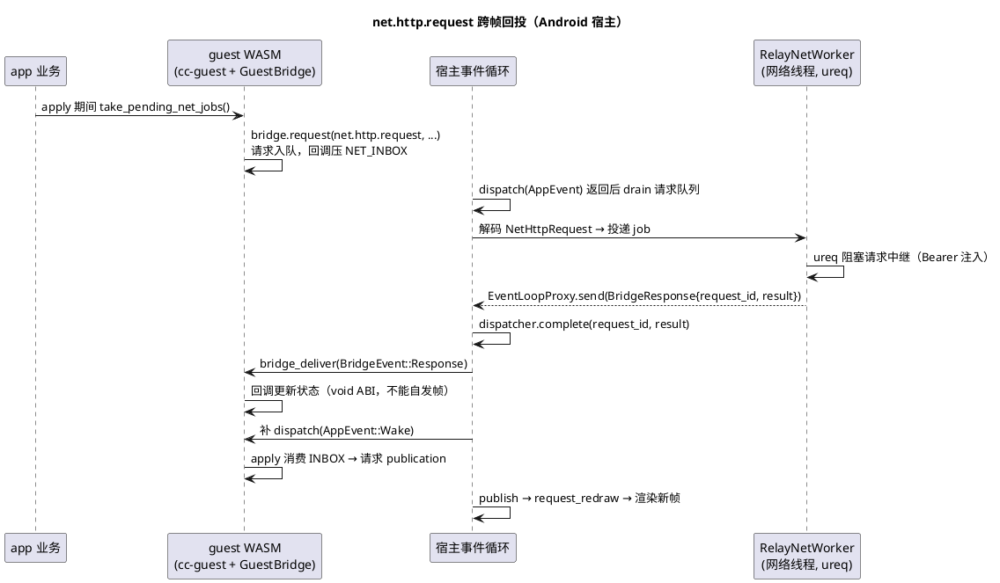

# 039-桥 net 能力与移动回投实施目标

> **状态：📋 实施目标（M0 实施中）。** `net.http.request` 具名能力的契约、Android 宿主接线与
> 跨帧回投生命周期；guest-runtime 的桥 fuel 修补**已合入**。设计语义总则见
> [桥/000-宿主桥总览](桥/000-宿主桥总览.md)，ABI 规范与帧循环见
> [032-宿主桥MVP实施目标](032-宿主桥MVP实施目标.md)，产品背景见
> [038-CC远程会话产品意图](038-CC远程会话产品意图.md)。

## 1. 动机与范围

guest WASM（wasm32-unknown-unknown）没有 socket，也没有异步 runtime；任何联网应用都必须经
宿主桥出站。CC Remote（038）是第一个真实消费者：手机 app 需要 HTTP 轮询中继。

**为什么是具名能力而不是 std**：[桥/000](桥/000-宿主桥总览.md) 规定任何能力进入 `std`
枚举时五个 Target 必须同时具备实现（webview 的桥尚未接线）。`net` 作为具名 scope
（`CapabilityId::named("net", "http", "request")`）可以只在真正需要的宿主（Android 先行）
注册，其余端 `canIUse` 如实回 `UnknownCapability`，不违反 std 承诺。

**为什么是请求/响应而不是推送**：桥的推送事件 `BridgeEvent::Message` 在
[桥/000](桥/000-宿主桥总览.md) §10.2 被明确后置（packet version bump，breaking change）。
`net.http.request` 用既有 `Response` 语义即可支撑轮询式应用；将来的推送路径（桥 v2）会复用
本能力建立的全部基建（provider、回投闭环、fuel 预算）。

## 2. 契约

| 项 | 值 |
|---|---|
| CapabilityId | `net.http.request`（具名 scope `net`，group `http`，name `request`） |
| 实现版本 | 1.0.0 |
| 请求载荷 | postcard `NetHttpRequest { method: Get\|Post, path: String, body: Option<Vec<u8>> }` |
| 响应载荷 | postcard `NetHttpResponse { status: u16, body: Vec<u8>, truncated: bool }` |
| 载荷定义处 | `services/cc-protocol/src/bridge.rs`（三端共享；`tela-bridge` crate 零改动） |

语义要点：

- **`path` 是相对路径**：base_url 与 Bearer token 只存在宿主侧 `RelayConfig`，永不进入
  guest WASM。guest 无法用此能力访问任意 URL——它是"访问本产品中继"的能力，不是通用 HTTP。
- **`status = 0` 表示传输层失败**（body 为短错误串）：app 据此进入离线退避，而不是把网络
  故障误当 HTTP 4xx/5xx。
- **不扩 `BridgeError`**：现有 5 变体（`UnknownCapability`/`VersionMismatch`/
  `PermissionDenied`/`KeyNotFound`/`Timeout`）没有网络错误分类；扩枚举是桥契约 breaking
  change。传输失败走 `status=0` 的成功响应表达，M2 再评估是否需要结构化错误。
- **128KiB 截断**：响应 body 达到 `MAX_RESPONSE_BODY_BYTES` 置 `truncated`，客户端按事件
  `seq` 游标分页续拉（`GET /v1/sync?since=` 本身就是分页协议，单页天然小于上限）。远低于桥
  包 `MAX_PACKET_BYTES=64MiB`，也压住 guest fuel 消耗。

## 3. 回投生命周期（跨帧异步）

与 032 §3.3 的异步能力一致，但首次在 Android 上落地完整链路：

两条硬规则：

1. **桥回调是 void ABI，不能请求 publication**（032 §2.2）：宿主在 `bridge_deliver` 之后必须
   补一次 `dispatch(AppEvent::Wake)` + `publish` + `request_redraw`，否则新状态永远不上屏。
2. **静止无帧时的上屏**：Android 的 AChoreographer 只在 `animation_active` 时排帧，但
   `request_redraw()`（android.rs）独立于动画排帧——回投闭环在 UI 完全静止时依然成立。这是
   M0 验收的专测项。

请求在 apply 期间入队、宿主 dispatch 后 drain 的交错语义与 desktop-guest 现状一致：
`apply_event` 帧首清空上一轮队列（`take_request_queue`），避免同一请求被宿主重复读取。

## 4. 桥 fuel 预算修补（已合入）

`GuestRuntime::bridge_deliver` / `bridge_drain_requests` 原先**不设置 fuel**，只复用上一次
`set_fuel` 的剩余额度。同步能力同轮回投时剩余额度充足，问题从未暴露；`net` 是第一个真正的
**跨帧异步回投**用户——回投发生时上一次 dispatch 的 fuel 早已耗尽或语义错位，等于定时炸弹。

已合入的实现事实（`crates/delivery/guest-runtime/src/runtime.rs`）：

- 新增 `const BRIDGE_ABI_FUEL: u64 = 50_000_000`；
- `bridge_deliver` 与 `bridge_drain_requests` 在调用 guest 导出前各自 `set_fuel`，失败信息带
  预算与剩余额度；
- `GuestRuntimeMetrics` 新增 `last_bridge_drain_fuel_consumed` /
  `last_bridge_deliver_fuel_consumed`，供宿主观测回投真实消耗（M0 验收用它确认 128KiB 级
  响应在预算内）。

## 5. Android 宿主接线

| 组件 | 位置 | 说明 |
|---|---|---|
| `RelayConfig` | `crates/targets/android/src/bridge.rs`（新建） | base_url + token；经 JNI `nativeConfigureRelay` 从 Kotlin `BuildConfig` 注入（`TelaActivity.onCreate` 在 `super.onCreate` 前，与 bundle index 同时机） |
| `RelayNetWorker` | 同上 | `thread::spawn` + mpsc，逐 job 阻塞 `ureq`（复用既有 rustls 栈，零新增网络依赖）；完成经 `EventLoopProxy` 回 `HostEvent::BridgeResponse` |
| `RelayNetProvider` | 同上 | `Provider`（version 1.0.0）；handle 解码请求投给 worker，返回 `ProviderOutcome::Pending` —— 桥体系**首个真实 Pending + complete 用户**（win32/macOS 全是同步 Immediate），需自带测试 |
| canIUse 静态表 | 同上 | 条目 = `std.base.canIUse` + `net.http.request`（注册即实现） |
| poll 线程 | `android.rs` | `sleep(1.5s) → HostEvent::PollTick`；窗口在时 `dispatch(AppEvent::Wake)` 驱动 guest 的轮询调度（guest 经 `next_deadline_ms` 表达期望间隔） |
| pump | `android.rs` `dispatch_guest` | publish 分支后 drain+dispatch 桥请求；Immediate 投递数 >0 时补一层 Wake |

Gradle 侧：`products/android/app/build.gradle.kts` 读 `telaRelayUrl`/`telaRelayToken` 属性 →
`BuildConfig` 字段；ops 构建时从 env 透传（token 不进 CLI 历史）。

## 6. 验收门（M0 视角）

| # | 验收项 | 手段 |
|---|---|---|
| 1 | postcard 载荷 roundtrip；`status=0` 语义；截断标志 | `tela-cc-protocol` 单测（已绿） |
| 2 | `bridge_deliver`/`bridge_drain_requests` 前置 fuel 断言 | `tela-guest-runtime` 单测（已合入） |
| 3 | Pending + complete 路径（异步回投跨帧可达、request_id 关联） | android `bridge.rs` 纯逻辑单测（`cfg(target_os="android")`，仿 win32 providers 先例） |
| 4 | 轮询往返：guest 排队 → 宿主执行 → 回投 → 上屏 | M0 真机：发消息 1.5s 内回复可见 |
| 5 | **静止态回投上屏**（无动画、无触摸） | M0 真机专测：等待屏幕完全静止后观察回复到达即渲染 |
| 6 | 离线退避：中继不可达 → `status=0` → 退避（1500ms 翻倍至 15s 封顶）→ 恢复 | M0 真机：关/开中继 |
| 7 | fuel 余量：典型 sync 页（≤128KiB）解码 + 重建的 consumed fuel 远低于 50M | `GuestRuntimeMetrics.last_bridge_deliver_fuel_consumed` 观察 |

## 7. 开放问题

- `BridgeError` 网络分类是否值得升桥 v2 一并处理（与 `BridgeEvent::Message` 推送同期评估）。
- iOS 端 `net` provider：静态路径按 [桥/000](桥/000-宿主桥总览.md) §7.3 直接注入 provider
  实例（不走 wire），与 Android 实现共享 `NetHttpRequest` 载荷；属 M2 后的 iOS 接入切片。
- `usesCleartextTraffic="true"` 是开发态便利；生产构建是否收敛为仅 tailnet 域名白名单，随
  038 §6 的 TLS 定案一起收口。
